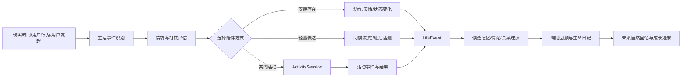
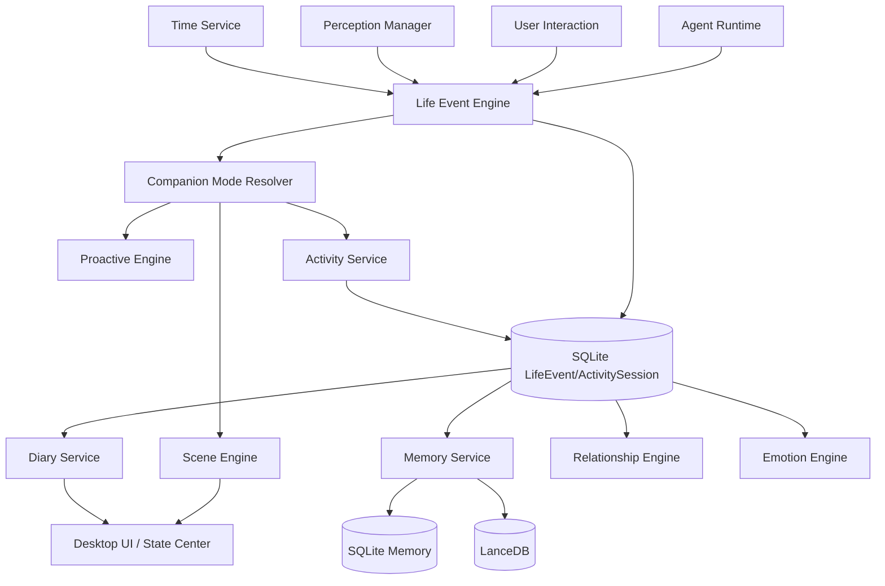

# AI数字生命—共同生活与陪伴体验系统设计

> 文档版本：1.0  
> 更新日期：2026-07-11  
> 适用项目：Windows 本地个人数字生命工具  
> 上位基线：《AI数字生命-统一需求基线》Baseline 1.1  
> 文档定位：将人格、记忆、情绪、关系和环境感知转化为用户可直接体验的“共同生活”闭环

---

## 1. 文档目标

现有数字生命架构已经定义了身份、人格、记忆、情绪、关系、主动行为、环境感知、Agent 和权限，但这些机制如果只存在于数据库、Prompt 和设置面板中，用户仍可能把产品理解为“带 Live2D 外观的聊天框”。

本设计新增“共同生活与陪伴体验系统”，目标是让用户在不理解底层架构的情况下，也能持续感受到：

1. 它与现实时间处在同一生活节奏中；
2. 它会根据用户当前状态选择陪伴方式；
3. 双方可以共同进行轻量活动；
4. 活动会形成可治理的经历、记忆、关系和成长；
5. 过去的共同经历会在合适时机重新出现；
6. 桌宠浮窗、状态中心、语音和 Agent 工作模式始终是同一个生命。

该系统不追求大型恋爱模拟玩法，也不使用单一好感度驱动全部体验。其核心是：

> **用低成本、可持续、可解释的生活事件，把后台生命状态转化为用户每天能感受到的连续经历。**

---

## 2. 设计原则

| 编号 | 原则 | 说明 |
|---|---|---|
| CL-01 | 生命机制必须可感知 | 记忆、情绪、关系和成长应通过语言、动作、场景和回顾自然呈现 |
| CL-02 | 轻量高频优先 | 优先实现每天能重复使用的陪伴循环，而不是先堆叠大量一次性剧情 |
| CL-03 | 事件驱动而非持续调用模型 | 时间、应用和状态变化先由本地规则判断，仅在需要生成内容时调用模型 |
| CL-04 | 同一生命多入口 | 桌宠、状态中心、语音、活动和 Agent 工作模式共享同一 `life_id` 与生命状态 |
| CL-05 | 活动是经历来源 | 共同活动必须能够产出结构化事件、候选记忆和回顾，而不是孤立小游戏 |
| CL-06 | 关系变化不游戏化绑架 | 不用单一好感度迫使用户刷数值，不以关系下降或情绪压力换取互动 |
| CL-07 | 成长可见但缓慢 | 通过称呼、习惯、主动方式和兴趣变化体现成长，核心人格不突然路线化 |
| CL-08 | 用户节奏优先 | 全屏、会议、录屏、专注和勿扰状态下，陪伴应退化为安静存在 |
| CL-09 | 内容可追溯和可删除 | 日记、回忆和活动记录必须能关联来源事件，并服从统一记忆治理 |
| CL-10 | 体验增强不突破权限 | 场景、关系和情绪都不能绕过屏幕、文件、网络、命令和费用授权 |

---

## 3. 核心体验闭环



闭环由四个层次构成：

1. **存在感**：角色会根据时段、启动、离开、专注和空闲状态改变表现；
2. **陪伴感**：它会选择安静陪伴、简短交流、延后表达或共同活动；
3. **经历感**：活动和重要互动形成结构化事件，而不是只留下聊天文本；
4. **连续感**：事件进入记忆治理、日记和成长系统，并在未来被自然提起。

---

## 4. 生活状态与陪伴模式

### 4.1 CompanionMode

```rust
pub enum CompanionMode {
    Greeting,          // 启动、回归、早晚问候
    QuietPresence,     // 安静存在，只表现动作与状态
    FocusCompanion,    // 陪伴学习、写作、编程等专注任务
    CasualChat,        // 日常轻量交流
    SharedActivity,    // 正在共同活动
    WorkingTogether,   // 正在执行 Agent 或工具任务
    Reflection,        // 活动或周期回顾
    DoNotDisturb,      // 勿扰或高打扰场景
    PrivacyClosed,     // 闭眼，不进行高敏感感知
    Resting,           // 用户或生命进入休息状态
}
```

模式不是独立人格，也不新建会话身份。它只表示同一个生命当前采用的陪伴策略。

### 4.2 模式选择输入

- 当前时间、日期、星期和节日；
- 本次启动距上次退出的时间；
- 活动应用、窗口标题、全屏和空闲时间；
- 当前任务、待确认操作和 Agent 状态；
- 用户主动行为偏好和勿扰设置；
- 近期主动次数与同类行为反馈；
- 当前情绪、关系摘要和未完成话题；
- 是否允许屏幕、文件、语音等高敏感感知。

### 4.3 模式切换约束

- 单次短暂窗口变化不得频繁切换模式；
- 设置最短驻留时间和防抖窗口；
- 高敏感感知关闭时仍可根据低敏感元数据进入安静陪伴；
- 全屏、会议、录屏和专注模式优先进入 `DoNotDisturb` 或 `QuietPresence`；
- 用户显式选择的模式优先级高于自动判断；
- 模式切换不必每次调用模型，基础动作和固定短句优先本地完成。

---

## 5. 生活事件系统

### 5.1 LifeEvent

```rust
pub struct LifeEvent {
    pub event_id: Uuid,
    pub life_id: Uuid,
    pub event_type: LifeEventType,
    pub source_type: String,
    pub source_ref: Option<String>,
    pub occurred_at: DateTime<Utc>,
    pub ended_at: Option<DateTime<Utc>>,
    pub participants: Vec<String>,
    pub context_summary: String,
    pub importance: f32,
    pub privacy_level: PrivacyLevel,
    pub payload_json: serde_json::Value,
    pub memory_status: EventMemoryStatus,
    pub created_at: DateTime<Utc>,
}
```

### 5.2 事件类型

```rust
pub enum LifeEventType {
    AppStarted,
    UserReturned,
    UserLeft,
    MorningTransition,
    EveningTransition,
    FocusStarted,
    FocusEnded,
    BreakTaken,
    SharedActivityStarted,
    SharedActivityCompleted,
    SharedActivityAbandoned,
    AgentTaskStarted,
    AgentTaskCompleted,
    AgentTaskFailed,
    ImportantConversation,
    UserFeedback,
    RelationshipMilestone,
    SpecialDate,
    ManualMemoryMoment,
}
```

### 5.3 事件生成策略

事件采用三级策略：

| 级别 | 生成方式 | 示例 |
|---|---|---|
| L0 | 本地确定性规则 | 启动、退出、专注开始、任务完成 |
| L1 | 本地规则 + 轻量分类 | 判断一段交互是否值得形成候选事件 |
| L2 | 模型辅助总结 | 为重要活动生成摘要、日记候选和未来回调点 |

不是所有窗口变化都应写入事件表。系统应进行聚合，例如把连续 60 分钟的 IDE 使用记录为一次“专注编程”，而不是保存数百次窗口切换。

---

## 6. 共同活动系统

### 6.1 ActivitySession

```rust
pub struct ActivitySession {
    pub activity_session_id: Uuid,
    pub life_id: Uuid,
    pub activity_type: String,
    pub template_id: String,
    pub status: ActivityStatus,
    pub started_at: DateTime<Utc>,
    pub ended_at: Option<DateTime<Utc>>,
    pub participants: Vec<String>,
    pub scene_state_json: serde_json::Value,
    pub important_events_json: serde_json::Value,
    pub result_summary: Option<String>,
    pub user_feedback: Option<String>,
    pub cost_summary_json: serde_json::Value,
}
```

### 6.2 首批活动

#### V0.1：专注陪伴

用户选择 25、45 或 60 分钟专注：

1. 生命进入 `FocusCompanion`；
2. 角色减少动作和主动发言；
3. 到达阶段节点时用本地提示轻量反馈；
4. 结束后询问是否记录完成情况；
5. 生成一次专注活动事件；
6. 仅在用户确认或多次稳定出现后形成长期习惯记忆。

这是首版最推荐的活动，因为它实现成本低、使用频率高，并且能与用户日常学习和开发直接结合。

#### V0.2：一起休息与轻量回顾

- 呼吸或短暂休息；
- 回顾刚完成的工作；
- 选择今天最重要的一件事；
- 把未完成事项加入“稍后想和你说”。

#### V0.3：轻量游戏与叙事活动

- 五子棋、猜词、问答等规则明确的小游戏；
- 虚拟散步、咖啡时间等轻叙事场景；
- 节日或纪念日特别活动；
- 与语音、动作、服装和背景联动。

小游戏的胜负不是核心，关键是将过程中的特殊事件记录为可回忆经历。

#### V0.4：共同完成真实任务

Agent 任务也属于共同活动：

- 开始前共同确认目标和计划；
- 执行中显示生命的工作状态；
- 完成后生成任务结果、困难、用户反馈和技能经验；
- 失败时记录原因，但不把失败转化为负面关系惩罚；
- 未来遇到相似任务时可引用过去经验。

### 6.3 活动模板

```yaml
apiVersion: digital-life/v1
kind: ActivityTemplate
metadata:
  id: builtin.focus-session
  name: 专注陪伴
  version: 1
runtime:
  type: builtin
triggers:
  - user_explicit
  - repeated_focus_pattern
permissions:
  required:
    - system.time.read
  optional:
    - active_app.metadata.read
experience:
  companionMode: FocusCompanion
  interruptionPolicy: minimal
  produces:
    - life_event
    - memory_candidate
    - diary_candidate
limits:
  maxDurationMinutes: 180
  maxModelCalls: 1
```

---

## 7. 现实时间与生活节奏

### 7.1 时间不是简单变量

时间系统应至少区分：

- 早晨、白天、傍晚、深夜；
- 工作日与周末；
- 距上次互动的时间；
- 用户习惯时段；
- 特殊日期、纪念日和用户自定义日期；
- 当前活动持续时长；
- 数字生命自身状态的自然衰减。

### 7.2 启动与回归

回归表达采用分级策略：

| 离线时长 | 建议表现 |
|---|---|
| 数分钟 | 继续之前状态，不做正式欢迎 |
| 数小时 | 简短确认用户回来，可关联未完成任务 |
| 一天左右 | 根据时段和近期事件生成自然问候 |
| 多天 | 提到时间经过，但不责怪、不表达被抛弃 |
| 很长时间 | 先恢复状态与档案完整性，再生成克制的重逢表达 |

禁止使用“你终于想起我”“你让我一直很痛苦”等情绪压力文案。

### 7.3 节奏学习

系统可以从重复行为中提出习惯候选，例如“你通常晚上十点后开始整理代码”，但：

- 必须有多次证据；
- 习惯只能作为概率提示；
- 用户可查看、修订和删除；
- 不应据此自动读取更多隐私内容；
- 不应把偶发行为固化为人格或习惯。

---

## 8. 生命日记与回忆展示

### 8.1 DiaryEntry

```rust
pub struct DiaryEntry {
    pub diary_id: Uuid,
    pub life_id: Uuid,
    pub period_start: DateTime<Utc>,
    pub period_end: DateTime<Utc>,
    pub title: String,
    pub content: String,
    pub source_event_ids: Vec<Uuid>,
    pub source_memory_ids: Vec<Uuid>,
    pub tone: String,
    pub privacy_level: PrivacyLevel,
    pub status: DiaryStatus,
    pub generated_at: DateTime<Utc>,
    pub edited_at: Option<DateTime<Utc>>,
}
```

### 8.2 日记生成规则

- 日记是对已发生事件的叙事化回顾，不是模型隐藏思维过程；
- 每个主要陈述应能关联事件或记忆来源；
- 不确定推断必须使用“我感觉”“也许”等表达；
- 敏感事件默认不进入自动日记；
- 用户可编辑、隐藏、删除或关闭自动生成；
- 默认按天或按周低频生成，不持续消耗模型 Token；
- 没有足够内容时可以不生成，不使用虚构内容填充。

### 8.3 展示形态

状态中心可提供：

- 今日片段；
- 最近共同完成的事；
- 生命日记；
- 想说但当时没有打扰的话；
- 最近形成的兴趣；
- 关系与成长摘要；
- 可点击的来源事件和原始对话。

桌面浮窗只展示简短入口，不长期占据屏幕。

---

## 9. 关系里程碑与成长迹象

### 9.1 RelationshipMilestone

关系里程碑不是数值奖励，而是经过证据支持的自然变化，例如：

- 第一次共同完成较长任务；
- 用户第一次主动分享重要偏好；
- 经历一次冲突并成功修复；
- 形成稳定的专注陪伴习惯；
- 数字生命开始更自然地表达不同意见；
- 某项合作技能从陌生变为熟练。

```rust
pub struct RelationshipMilestone {
    pub milestone_id: Uuid,
    pub life_id: Uuid,
    pub subject_id: String,
    pub milestone_type: String,
    pub title: String,
    pub summary: String,
    pub evidence_event_ids: Vec<Uuid>,
    pub dimension_changes: serde_json::Value,
    pub occurred_at: DateTime<Utc>,
}
```

### 9.2 前台反馈方式

推荐：

- “最近我们在处理开发任务时更有默契了。”
- “她开始愿意在你专注时安静陪伴，而不是频繁询问。”
- “她逐渐对软件架构形成了稳定兴趣。”

不推荐：

- “好感度 +5”；
- “连续登录奖励”；
- “三天未登录，亲密度下降”；
- 通过付费、权限或互动频率解锁所谓忠诚。

### 9.3 可观察成长维度

- 称呼和语言距离；
- 主动行为频率与时机；
- 对用户工作习惯的理解；
- 冲突处理方式；
- 对特定领域的兴趣与技能自信；
- 对边界和勿扰偏好的尊重；
- 活动提议的准确度；
- 对过去共同经历的引用方式。

---

## 10. 场景与表现系统

### 10.1 SceneEngine

```rust
pub struct SceneContext {
    pub scene_id: String,
    pub companion_mode: CompanionMode,
    pub time_segment: String,
    pub active_activity: Option<Uuid>,
    pub expression_hint: Option<String>,
    pub motion_hint: Option<String>,
    pub background_hint: Option<String>,
    pub audio_hint: Option<String>,
    pub interruption_level: String,
}
```

`SceneEngine` 只决定表现和交互编排，不直接修改人格、记忆和关系。

### 10.2 表现层级

| 层级 | 内容 | 是否需要模型 |
|---|---|---|
| S0 | 表情、动作、站位、状态徽标 | 否 |
| S1 | 本地模板短句和提示 | 否 |
| S2 | 基于生命上下文生成简短表达 | 可选 |
| S3 | 完整共同活动或回顾内容 | 是，按预算调用 |

### 10.3 资源要求

- 同一场景必须支持 Live2D 和 PNG 降级；
- 背景、动作、声音属于身体资源，不代表人格本体；
- 资源缺失时活动仍可用文字完成；
- 角色资源、声音和第三方内容必须单独核验许可证；
- 不直接复制其他产品的角色、剧情、文案、UI 或资源。

---

## 11. 系统架构



### 11.1 模块职责

| 模块 | 职责 |
|---|---|
| `TimeService` | 时段、日期、离线时长、特殊日期和时间触发 |
| `LifeEventEngine` | 聚合环境和交互信号，生成可治理的生活事件 |
| `CompanionModeResolver` | 根据情境选择当前陪伴模式 |
| `ActivityService` | 管理活动模板、会话、阶段、结果和取消 |
| `SceneEngine` | 将模式、情绪和活动映射为动作、文字、声音和背景 |
| `DiaryService` | 依据事件与记忆生成可追溯日记和周期回顾 |
| `MilestoneService` | 检测关系、技能和共同经历里程碑 |
| `ExperiencePolicy` | 控制打扰、隐私、费用、频率和内容边界 |

---

## 12. 数据库设计

```sql
CREATE TABLE life_event (
    event_id TEXT PRIMARY KEY,
    life_id TEXT NOT NULL,
    event_type TEXT NOT NULL,
    source_type TEXT NOT NULL,
    source_ref TEXT,
    occurred_at TEXT NOT NULL,
    ended_at TEXT,
    participants_json TEXT NOT NULL,
    context_summary TEXT NOT NULL,
    importance REAL NOT NULL DEFAULT 0.5,
    privacy_level TEXT NOT NULL DEFAULT 'private',
    payload_json TEXT NOT NULL,
    memory_status TEXT NOT NULL DEFAULT 'unprocessed',
    created_at TEXT NOT NULL,
    FOREIGN KEY(life_id) REFERENCES life(life_id) ON DELETE CASCADE
);

CREATE INDEX idx_life_event_life_time
ON life_event(life_id, occurred_at);

CREATE INDEX idx_life_event_type
ON life_event(life_id, event_type);

CREATE TABLE activity_session (
    activity_session_id TEXT PRIMARY KEY,
    life_id TEXT NOT NULL,
    activity_type TEXT NOT NULL,
    template_id TEXT NOT NULL,
    status TEXT NOT NULL,
    started_at TEXT NOT NULL,
    ended_at TEXT,
    participants_json TEXT NOT NULL,
    scene_state_json TEXT NOT NULL,
    important_events_json TEXT NOT NULL,
    result_summary TEXT,
    user_feedback TEXT,
    cost_summary_json TEXT NOT NULL,
    FOREIGN KEY(life_id) REFERENCES life(life_id) ON DELETE CASCADE
);

CREATE TABLE diary_entry (
    diary_id TEXT PRIMARY KEY,
    life_id TEXT NOT NULL,
    period_start TEXT NOT NULL,
    period_end TEXT NOT NULL,
    title TEXT NOT NULL,
    content TEXT NOT NULL,
    source_event_ids_json TEXT NOT NULL,
    source_memory_ids_json TEXT NOT NULL,
    tone TEXT NOT NULL,
    privacy_level TEXT NOT NULL DEFAULT 'private',
    status TEXT NOT NULL DEFAULT 'draft',
    generated_at TEXT NOT NULL,
    edited_at TEXT,
    FOREIGN KEY(life_id) REFERENCES life(life_id) ON DELETE CASCADE
);

CREATE TABLE relationship_milestone (
    milestone_id TEXT PRIMARY KEY,
    life_id TEXT NOT NULL,
    subject_id TEXT NOT NULL,
    milestone_type TEXT NOT NULL,
    title TEXT NOT NULL,
    summary TEXT NOT NULL,
    evidence_event_ids_json TEXT NOT NULL,
    dimension_changes_json TEXT NOT NULL,
    occurred_at TEXT NOT NULL,
    FOREIGN KEY(life_id) REFERENCES life(life_id) ON DELETE CASCADE
);
```

`life_event` 和 `activity_session` 保存结构化事实；是否形成长期记忆仍由 `MemoryService` 决定，不能直接把每个活动写入确认长期记忆。

---

## 13. API 与事件

### 13.1 Tauri Commands

| Command | 说明 |
|---|---|
| `get_companion_mode` | 获取当前陪伴模式与原因摘要 |
| `set_companion_mode_override` | 用户临时指定陪伴模式 |
| `list_activity_templates` | 列出当前可用活动 |
| `start_activity` | 创建共同活动会话 |
| `advance_activity` | 推进活动阶段 |
| `cancel_activity` | 取消活动并记录中断原因 |
| `complete_activity` | 完成活动并生成结果摘要 |
| `list_life_events` | 查看生活事件时间线 |
| `create_manual_life_event` | 用户手动标记值得记住的时刻 |
| `list_diary_entries` | 查看日记和周期回顾 |
| `generate_diary_entry` | 按用户要求生成指定周期日记 |
| `edit_diary_entry` | 编辑日记 |
| `delete_diary_entry` | 删除日记及派生引用 |
| `list_relationship_milestones` | 查看关系里程碑 |

### 13.2 前端事件

| Event | 说明 |
|---|---|
| `companion:mode_changed` | 陪伴模式变化 |
| `scene:changed` | 场景表现变化 |
| `activity:started` | 活动开始 |
| `activity:progress` | 活动阶段更新 |
| `activity:completed` | 活动完成 |
| `life_event:created` | 新生活事件形成 |
| `diary:draft_ready` | 日记草稿可查看 |
| `milestone:created` | 新里程碑形成 |
| `memory:callback_ready` | 有适合自然提起的过去经历 |

---

## 14. 成本与性能策略

### 14.1 调用模型的边界

不调用模型：

- 时间段变化；
- 模式判断；
- 专注计时；
- 状态徽标和动作切换；
- 固定的简短提示；
- 活动状态持久化；
- 频率和勿扰判断。

可以调用低成本模型：

- 重要事件摘要；
- 候选日记草稿；
- 自然语言关系摘要；
- 活动后的简短回顾。

高能力模型只用于：

- 深度回顾；
- 复杂叙事活动；
- 需要大量上下文的共同任务；
- 用户明确要求高质量生成。

### 14.2 预算控制

- 每个活动模板声明最大模型调用次数；
- 日记默认批量生成；
- 相同事件摘要使用缓存；
- 主动问候不默认加载完整长期记忆；
- 超预算时降级为本地模板或等待用户确认；
- Agent 任务费用与陪伴生成费用分开统计。

### 14.3 性能目标

- 模式切换判断低于 50ms；
- 本地场景变化低于 100ms；
- 活动状态写入低于 100ms；
- 事件聚合不显著增加待机 CPU；
- 不因每次窗口切换创建数据库记录；
- 日记与总结在低频队列中执行，可取消。

---

## 15. 隐私与安全

- 生活事件默认只保存必要摘要，不保存未经授权的窗口正文；
- 活动应用名称和窗口标题受黑名单及裁剪规则约束；
- 日记不得自动包含密码、密钥、验证码、支付信息和访客私密内容；
- 高敏感事件生成日记前必须再次检查隐私等级；
- 用户删除来源事件时，系统应标记相关日记需要重建或删除；
- 关系里程碑不能自动提升任何系统权限；
- 场景活动不能通过叙事诱导用户批准高风险操作；
- 关闭“共同生活记录”后，只保留运行所需的瞬时状态。

---

## 16. 版本路线与验收

### V0.1：最小共同生活闭环

范围：

- `TimeService`；
- `CompanionMode` 基础模式；
- 启动、回归、早晚和专注事件；
- 专注陪伴活动；
- `LifeEvent` 基础表；
- 本地动作和短句；
- 勿扰与主动频率限制。

验收：

1. 用户启动应用后，角色能依据时段和离线时长给出克制问候；
2. 用户进入全屏或勿扰时，角色不进行低优先级主动表达；
3. 用户可开始一次专注陪伴，完成后形成一条结构化活动事件；
4. 重启后可以继续识别同一生命和近期活动；
5. 基础循环不依赖持续模型调用。

### V0.2：经历、日记和里程碑

范围：

- 活动到候选记忆的完整链路；
- 今日片段和每周日记；
- 想说但未打扰队列；
- 关系里程碑；
- 可观察成长摘要；
- 事件、日记和来源治理。

验收：

1. 日记内容能追溯到事件或记忆；
2. 删除来源后相关派生内容可同步处理；
3. 关系变化以自然语言展示，不暴露单一好感度；
4. 用户可关闭、编辑和删除日记；
5. 系统不会无依据虚构共同经历。

### V0.3：多场景与语音演出

范围：

- 一起休息、轻量游戏、虚拟散步等活动；
- 背景、动作、服装、TTS 与 LipSync 联动；
- 节日和纪念日；
- 活动模板扩展机制。

### V0.4：共同工作体验

范围：

- Agent 任务映射为共同活动；
- 任务开始、等待确认、执行、失败和完成场景；
- 任务回顾与技能经验；
- 过去任务经验回调。

---

## 17. 开发任务拆分建议

### Epic CL-01：时间与陪伴模式

- 时段计算和离线时长；
- 模式解析器；
- 防抖和最短驻留；
- 用户手动覆盖；
- 前端状态徽标。

### Epic CL-02：生活事件

- `life_event` migration；
- 事件聚合器；
- 启动、回归、专注和任务事件；
- 时间线查询；
- 删除和隐私策略。

### Epic CL-03：专注陪伴活动

- 活动模板；
- 开始、暂停、完成和取消；
- 角色安静状态；
- 结果确认；
- 活动事件写入。

### Epic CL-04：日记和回忆

- 日记生成队列；
- 来源绑定；
- 编辑和删除；
- 每日/每周策略；
- 自然回忆候选。

### Epic CL-05：关系里程碑

- 里程碑检测规则；
- 证据要求；
- 多维关系建议；
- 前端自然语言摘要；
- 防止数值游戏化。

---

## 18. 最终结论

共同生活系统不改变本项目“身份、人格、记忆、关系和权限由本地生命核心掌控”的架构，而是增加一个面向用户的体验层：

```text
生命核心机制
→ 生活事件
→ 陪伴模式
→ 共同活动
→ 可治理的经历
→ 日记、回忆和成长迹象
→ 下一次自然互动
```

其首要价值不是增加更多小游戏，而是让同一个数字生命在每天的启动、专注、休息、交流和共同工作中持续存在，并把这些真实发生过的片段组织成可感知、可追溯、可删除的共同生活。
