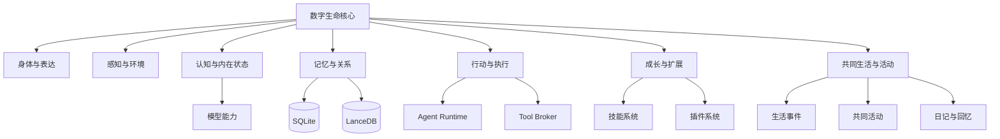
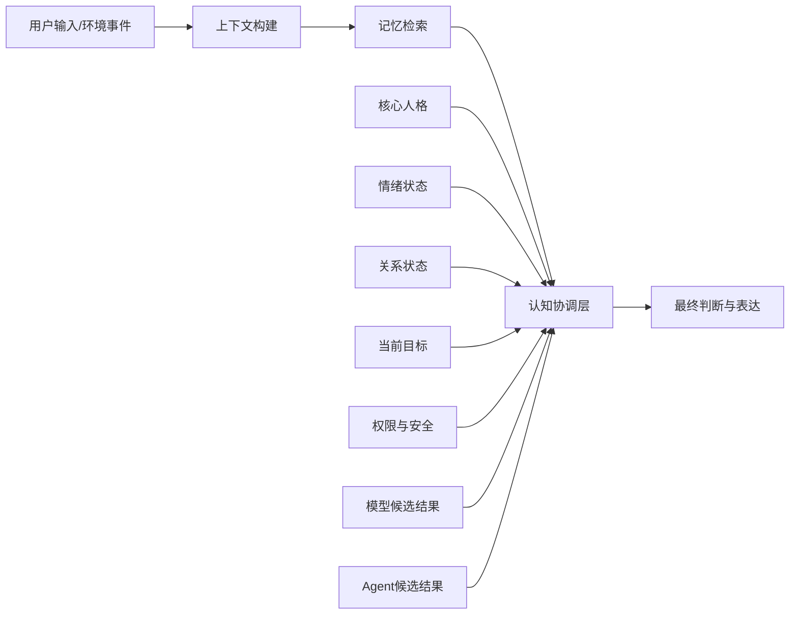
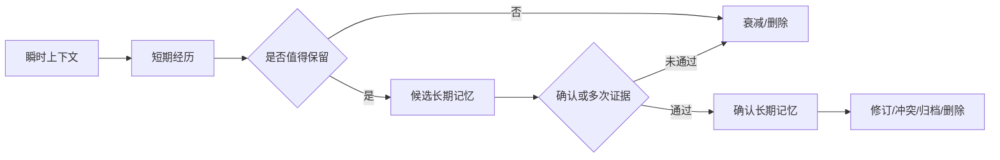
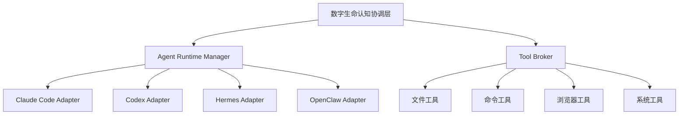
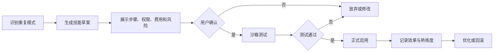
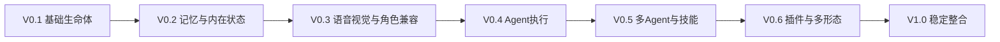

# AI桌宠—功能图谱与扩展架构

> 文档版本：2.1  
> 更新日期：2026-07-11  
> 基线：以《AI数字生命-统一需求基线》为准

---

## 1. 文档目的

本文件用于回答三个问题：

1. 数字生命由哪些能力构成；
2. 各能力之间有什么依赖关系；
3. 哪些能力属于核心，哪些通过模型、Agent、技能或插件扩展。

本文件不再把所有功能都描述为“P0”，也不再使用“一切皆插件”作为绝对原则。身份、人格、记忆、关系、权限和生命连续性必须属于核心内核，不能交给插件直接控制。

---

## 2. 总体能力模型



六大能力域分别对应：

| 能力域 | 生命含义 | 主要职责 |
|---|---|---|
| 身体与表达 | 身体、声音和外在表现 | Live2D、PNG、动作、表情、文字、语音 |
| 感知与环境 | 感官 | 窗口、屏幕、语音、文件、时间、系统状态 |
| 认知与内在状态 | 思考和当前精神状态 | 目标、情绪、关注点、反思、模型协调 |
| 记忆与关系 | 经历和人与人之间的联系 | 分层记忆、多维关系、身份连续性 |
| 行动与执行 | 双手 | Agent、工具、文件、命令、浏览器和系统操作 |
| 成长与扩展 | 学习和能力进化 | 人格成长、技能熟练度、新技能、插件和新身体 |
| 共同生活与活动 | 共享的日常经历 | 现实时间、陪伴模式、生活事件、共同活动、日记、回忆和里程碑 |

---

## 3. 核心内核与可扩展边界

### 3.1 必须由核心内核掌控

以下能力不能被插件或外部 Agent 直接改写：

- `life_id` 与身份连续性；
- 核心人格和人格版本；
- 长期记忆正文及其治理状态；
- 多维关系状态；
- 权限和风险策略；
- 核心目标；
- 备份、恢复和分支关系；
- 重要成长记录；
- 生活事件来源关系、日记来源和关系里程碑证据。

### 3.2 可以通过接口扩展

- 新模型供应商；
- 新 Agent Runtime；
- 新工具；
- 新感知来源；
- 新动作、声音和身体资源；
- 新技能模板；
- 新游戏或应用适配；
- 新的状态变化建议。

扩展模块只能提交“建议”或“候选结果”，最终写入核心数据必须经过内核审核。

---

## 4. 身体与表达能力

| 能力 | 首次实现 | 目标版本 | 说明 |
|---|---|---|---|
| 静态 PNG 身体 | V0.1 | V0.1 | 调试、低配和缺少 Live2D 时降级 |
| Live2D 渲染 | V0.1 | V0.1 | 正式桌面身体 |
| 透明窗口、拖拽、缩放 | V0.1 | V0.1 | Windows 桌面常驻 |
| 文字气泡 | V0.1 | V0.1 | 输入、流式输出、收起 |
| 基础表情与动作 | V0.1 | V0.1 | 待机、说话、开心、低落、思考 |
| 状态表现 | V0.1 | V0.2 | 聆听、思考、执行、等待确认、勿扰、闭眼 |
| TTS | V0.3 | V0.3 | 云端优先，可缓存 |
| LipSync | V0.3 | V0.3 | 音量或音素驱动 |
| 按键语音输入 | V0.3 | V0.3 | 不默认持续监听 |
| 多身体资源 | V0.3 | V0.6 | 多 Live2D、服装、声音、动作包 |
| 全双工语音 | 后续 | V1.x | 唤醒词、持续监听、打断 |
| 3D/VR/移动端身体 | 远期 | V2.x | 不影响核心身份 |

### 4.1 身体状态映射

```text
内部状态
→ 表达策略
→ 文字语气
→ TTS 参数
→ 表情
→ 动作
```

身体资源只能决定“如何表现”，不能直接修改人格、情绪和关系。

---

## 5. 感知能力

### 5.1 低敏感元数据感知

| 能力 | 默认策略 | 版本 |
|---|---|---|
| 活动应用 | 可持续开启 | V0.2 |
| 窗口标题 | 可持续开启，可配置黑名单 | V0.2 |
| 全屏状态 | 可持续开启 | V0.2 |
| 空闲时间 | 可持续开启，只统计时长 | V0.2 |
| 时间和日期 | 默认开启 | V0.1 |
| 基础系统状态 | 可选 | V0.2 |

### 5.2 高敏感内容感知

| 能力 | 授权方式 | 版本 |
|---|---|---|
| 截图 | 本次/会话/应用/区域/时段 | V0.3 |
| OCR | 继承截图授权 | V0.3 |
| Vision 分析 | 云端调用单独授权 | V0.3 |
| 麦克风 | 按键触发，后续可选持续监听 | V0.3 |
| 文件正文 | 拖拽或显式选择 | V0.1/V0.4 |
| 剪贴板 | 默认关闭 | V0.6 |
| 浏览器正文 | 浏览器插件授权 | V0.6 |

### 5.3 隐私控制能力

- 全局“闭眼”按钮；
- 正在观察的常驻提示；
- 应用黑名单；
- 区域遮挡；
- 密码框、通知和聊天窗口自动遮挡；
- 截图默认不保存；
- 云端外发审计；
- 敏感信息识别与裁剪。

---

## 6. 认知与内在状态

### 6.1 认知协调层



认知协调层负责：

- 识别目标和任务类型；
- 判断需要哪些记忆；
- 选择模型、Agent 或工具；
- 处理候选结果冲突；
- 应用人格、情绪和关系影响；
- 检查权限、成本和风险；
- 形成统一输出和行动计划。

### 6.2 结构化内在状态

| 状态 | 示例 | 持久化策略 |
|---|---|---|
| 当前关注点 | 正在关注用户的项目进度 | 短期 |
| 未完成目标 | 等待用户确认的代码修改 | 任务级 |
| 情绪来源 | 上一次任务失败导致轻度沮丧 | 有效期 |
| 关系认识 | 合作默契提高，但边界仍较克制 | 周期更新 |
| 正在形成的兴趣 | 开始对软件架构产生兴趣 | 候选成长 |
| 想表达的话题 | 想在用户空闲时讨论某件事 | 延后队列 |
| 待整理记忆 | 一次重要对话尚未总结 | 周期任务 |

### 6.3 低频反思

反思触发点：

- 重要对话结束；
- 长任务完成；
- 每日或每周周期；
- 记忆冲突；
- 关系维度显著变化；
- 人格成长候选形成。

反思只保存结论、证据和影响，不保存完整模型推理链。

---

## 7. 记忆与关系能力

### 7.1 记忆生命周期



### 7.2 混合检索

```text
最终相关性
= 语义相似度
+ 全文关键词匹配
+ 重要度
+ 时间相关性
+ 当前目标相关性
+ 关系相关性
+ 来源可信度
- 过期和冲突惩罚
```

### 7.3 数据存储

| 数据 | 存储位置 | 权威性 |
|---|---|---|
| 记忆正文、来源、状态 | SQLite | 权威 |
| Embedding 和向量索引 | LanceDB | 可重建 |
| 短期上下文缓存 | 内存/本地缓存 | 可丢弃 |
| 对话原文 | SQLite | 权威，可按策略归档 |
| 备份档案 | 本地加密文件 | 恢复依据 |

### 7.4 多维关系

关系维度包括：

- 熟悉度；
- 信任感；
- 情感亲近；
- 合作默契；
- 安全感；
- 依赖倾向；
- 边界舒适度；
- 关系张力。

关系状态影响表达距离和主动策略，但不直接改变系统权限。

---

## 8. 情绪与主动行为

### 8.1 情绪数据结构

```text
EmotionState
├── emotion_type
├── intensity
├── trigger_source
├── started_at
├── expected_decay
├── unresolved_reason
├── affected_goals
└── affected_relationships
```

### 8.2 情绪作用范围

允许影响：

- 表情、动作和声音；
- 语言风格；
- 注意力偏向；
- 主动交流意愿；
- 事件评价；
- 记忆重要度；
- 低风险目标排序。

禁止影响：

- 安全规则；
- 权限校验；
- 高风险操作确认；
- 正常任务的最低质量；
- 核心人格和身份。

### 8.3 主动意图决策

```text
主动得分
= 事件重要性
+ 与用户任务相关性
+ 自身表达意愿
+ 用户历史接受程度
- 用户专注程度
- 最近主动次数
- 打扰风险
```

输出状态：

- `express_now`；
- `defer`；
- `store_silently`；
- `cancel`；
- `urgent_notify`。

---


## 9. 共同生活与活动能力

### 9.1 能力闭环


### 9.2 陪伴模式

| 模式 | 说明 | 首次版本 |
|---|---|---|
| 问候 | 启动、回归、早晚和特殊日期 | V0.1 |
| 安静存在 | 仅动作、状态和低频表达 | V0.1 |
| 专注陪伴 | 陪伴学习、写作和开发 | V0.1 |
| 日常交流 | 普通轻量对话 | V0.1 |
| 共同活动 | 游戏、散步、休息和场景互动 | V0.2/V0.3 |
| 共同工作 | Agent 或工具任务 | V0.4 |
| 回顾反思 | 活动回顾、日记和周期总结 | V0.2 |
| 勿扰/闭眼 | 减少打扰或关闭高敏感感知 | V0.1/V0.3 |

### 9.3 生活事件

生活事件用于聚合启动、回归、专注、活动、重要对话和 Agent 任务等真实发生的片段。它只保存必要摘要和结构化元数据，不把每次窗口切换或每句话都变成永久记录。

事件可产生：

- 候选记忆；
- 情绪变化建议；
- 多维关系变化建议；
- 日记草稿；
- 关系或技能里程碑；
- 未来自然回忆候选。

### 9.4 共同活动

| 活动 | 目的 | 版本 |
|---|---|---|
| 专注陪伴 | 建立最小高频生活闭环 | V0.1 |
| 一起休息/轻量回顾 | 降低打扰并形成近期总结 | V0.2 |
| 轻量游戏 | 生成规则明确的共同经历 | V0.3 |
| 虚拟散步/咖啡时间 | 提供轻叙事场景 | V0.3 |
| 节日与纪念日 | 建立现实时间节奏 | V0.3 |
| 共同完成 Agent 任务 | 将真实工作转化为共同经历和技能经验 | V0.4 |

### 9.5 日记与里程碑

- 日记必须引用生活事件或记忆来源；
- 没有足够事实时不生成；
- 用户可以编辑、隐藏、删除和关闭；
- 里程碑基于长期证据，不以连续登录或付费触发；
- 关系变化默认以自然语言和行为变化呈现；
- 关系、场景和活动不能提升系统权限。

### 9.6 成本与隐私

- 模式判断、计时、动作和固定提示使用本地规则；
- 日记和活动总结低频批量调用模型；
- 每个活动声明调用上限和费用预算；
- 生活事件默认不保存未经授权的窗口正文；
- 桌宠、状态中心、活动和 Agent 共享同一生命上下文。


## 10. 模型能力层

### 10.1 Model Provider

模型层通过统一接口接入：

```rust
#[async_trait]
pub trait ModelProvider {
    async fn chat(&self, request: ChatRequest) -> Result<ChatStream, ModelError>;
    async fn vision(&self, request: VisionRequest) -> Result<VisionResult, ModelError>;
    async fn embed(&self, texts: &[String]) -> Result<Vec<Vec<f32>>, ModelError>;
    fn capabilities(&self) -> ModelCapabilities;
}
```

首版直接实现少量云端 API Adapter。LiteLLM 作为后续可选模型网关，用于：

- 多供应商统一接口；
- 自动回退；
- 重试和限流；
- Token 与费用统计；
- 模型别名和路由。

LiteLLM 不负责人格、记忆、任务规划和 Agent 生命周期。

### 10.2 模型使用策略

| 任务 | 优先能力 |
|---|---|
| 日常对话 | 成本与效果平衡的云端模型 |
| 深度推理 | 高能力推理模型 |
| 长文本与创作 | 长上下文模型 |
| Vision | 多模态模型 |
| Embedding | 云端 Embedding，后续本地 ONNX |
| 隐私过滤、评分和规则 | 本地 Rust 逻辑 |
| 断网降级 | 规则或可选本地模型 |

---

## 11. Agent 与工具执行

### 11.1 分层结构



### 11.2 Agent Runtime 必备能力

- 能力声明；
- 会话生命周期；
- 工作目录；
- 输入输出流；
- 取消和超时；
- Token/费用预算；
- 任务状态；
- 工具调用记录；
- 结果和产物收集；
- 故障恢复。

### 11.3 多 Agent 模式

| 模式 | 使用条件 | 约束 |
|---|---|---|
| 单 Agent | 日常和小任务 | 默认 |
| 主从协作 | 中大型任务 | 数字生命拆分、分配、审查和整合 |
| 有限自治团队 | 用户明确开启深度协作 | 最大轮次、预算、超时、停止条件 |

### 11.4 执行风险分级

| 风险 | 示例 | 策略 |
|---|---|---|
| 低 | 读取公开状态、整理自身数据 | 自动执行并记录 |
| 中 | 打开程序、创建草稿、修改指定工作区 | 按范围授权 |
| 高 | 删除、发送、发布、系统修改 | 逐次确认 |
| 极高 | 凭据、付款、不可逆系统操作 | 默认禁止或人工接管 |

---

## 12. 技能成长

### 12.1 技能来源

- 内置规则；
- Agent 能力；
- 工具组合；
- 插件能力；
- 用户定义工作流；
- 从重复行为中提议生成。

### 12.2 技能形成流程



技能不能直接修改核心人格和记忆治理规则。

---

## 13. 插件架构

### 13.1 插件类型

| 类型 | 可提供内容 |
|---|---|
| Perception | 新感知来源和环境数据 |
| Model | 新模型供应商 |
| Agent | 新 Agent Runtime |
| Tool | 文件、浏览器、应用和外部服务工具 |
| Expression | 动作、表情、声音、身体资源 |
| Integration | 游戏、IDE、日程、媒体等场景适配 |

### 13.2 插件权限声明

每个插件必须声明：

- 文件读取/写入范围；
- 网络域名；
- 屏幕和麦克风权限；
- 是否调用外部模型；
- 是否可能产生费用；
- 是否保存数据；
- 是否提出主动行为；
- CPU、内存和运行时限额。

### 13.3 插件状态变化协议

插件不能直接写核心表，只能返回：

```text
StateChangeProposal
├── proposal_type
├── source_plugin
├── evidence
├── requested_change
├── confidence
├── risk_level
└── expires_at
```

核心系统审核后决定接受、降级、延后或拒绝。

### 13.4 实施顺序

- V0.x：核心能力先以内置模块实现；
- V0.6：抽取稳定 Capability API；
- V0.6 以后：优先 WASM 沙箱；
- JavaScript 插件在隔离运行时和权限模型成熟后再评估。

---

## 14. 数据架构

```text
%APPDATA%/DigitalLife/
├── data/
│   ├── life.db                 # SQLite 权威数据
│   └── vectors/                # LanceDB 可重建索引
├── lives/<life_id>/
│   ├── persona/
│   ├── bodies/
│   ├── voices/
│   └── assets/
├── plugins/
├── cache/
├── logs/
└── backups/
```

### 14.1 核心数据域

- 生命身份；
- 人格版本；
- 实时状态；
- 记忆与来源；
- 多维关系；
- 目标和反思；
- 技能和熟练度；
- Agent 任务；
- 权限和审计；
- 备份与分支；
- 生活事件、活动会话、日记和关系里程碑。

### 14.2 向量索引原则

- SQLite 正文为权威数据；
- LanceDB 只保存向量与检索元数据；
- 使用 `memory_id` 和 `content_hash` 关联；
- 切换 Embedding 模型时全量重建；
- 删除记忆时同步删除向量；
- 通过 `VectorStore` 抽象未来迁移到 Qdrant。

---

## 15. 版本依赖图



### V0.1 基础生命体

- Live2D/PNG；
- 完全自定义生命模板；
- 云端文字对话；
- 统一人格输出；
- 对话记录；
- API Key；
- 本地备份；
- 现实时间、回归问候、安静存在和专注陪伴。

### V0.2 记忆与内在状态

- SQLite + LanceDB；
- 分层记忆；
- 情绪；
- 多维关系；
- 内在状态；
- 窗口感知；
- 主动行为；
- 生活事件、生命日记、关系里程碑和活动记忆闭环。

### V0.3 语音视觉与角色兼容

- 按键语音、TTS、LipSync；
- 截图、OCR、Vision；
- 隐私遮挡；
- 酒馆角色卡导入；
- 多身体资源；
- 轻量游戏、虚拟散步、节日和纪念日活动。

### V0.4 Agent 执行

- Agent Adapter；
- 单 Agent 路由；
- 文件和命令；
- Diff；
- 授权、日志、取消和回滚；
- 共同工作活动、任务回顾和技能经验。

### V0.5 多 Agent 与技能

- 主从协作；
- 有限自治团队；
- 预算与审查；
- 技能生成与熟练度。

### V0.6 插件与多形态

- WASM 插件；
- 权限沙箱；
- 故障隔离；
- 更多身体和场景能力。

---

## 16. 能力优先级定义

| 级别 | 定义 |
|---|---|
| P0 | 当前版本缺失后无法形成该版本的核心闭环 |
| P1 | 当前版本应完成，但可在迭代末尾补齐 |
| P2 | 体验增强或差异化能力 |
| P3 | 远期探索 |

优先级必须与目标版本结合使用，不能把远期功能标成当前版本 P0。

---

## 17. 核心竞争力

项目真正的差异化不在于功能数量，而在于以下组合：

1. 数字生命身份与模型能力解耦；
2. 结构化人格、记忆、情绪、关系和成长；
3. 环境感知与主动行为；
4. 受控的 Agent 执行和多 Agent 协作；
5. 可审计的权限与隐私边界；
6. 可更换身体但保持生命连续性；
7. 插件只能扩展能力，不能劫持核心自我；
8. 通过现实时间、共同活动、日记和自然回忆，把后台生命机制转化为可体验的共同生活。
