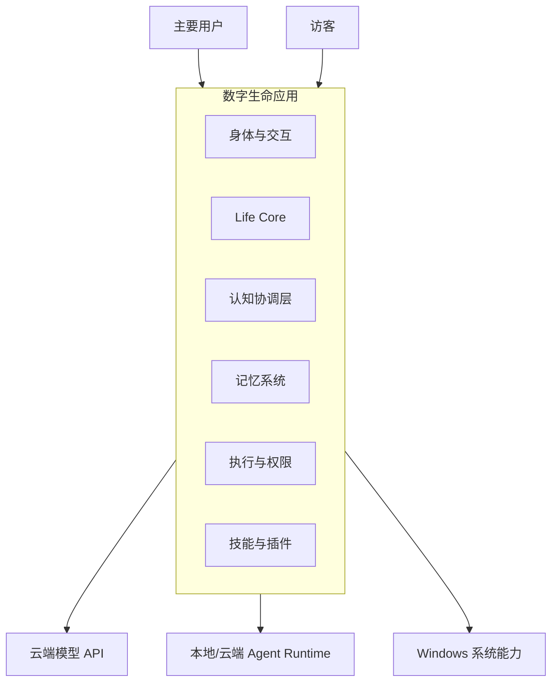
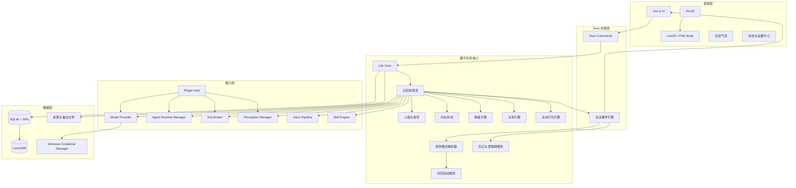
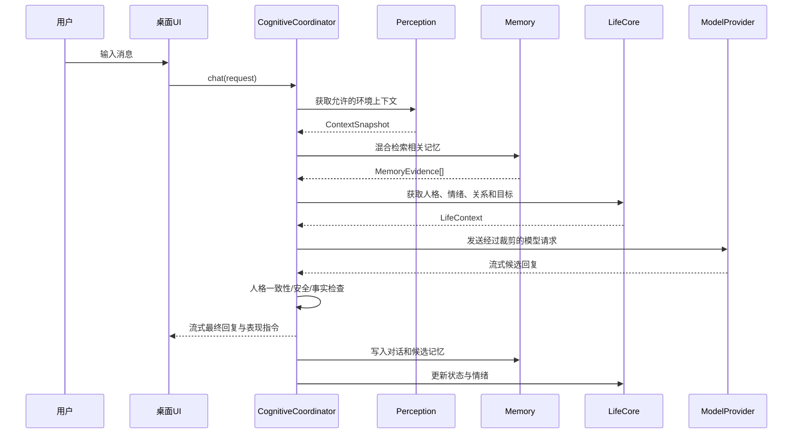
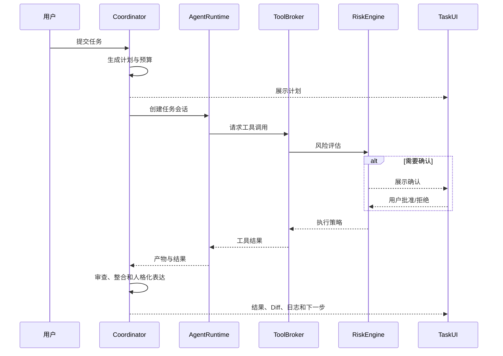
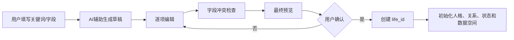
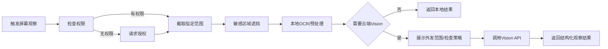
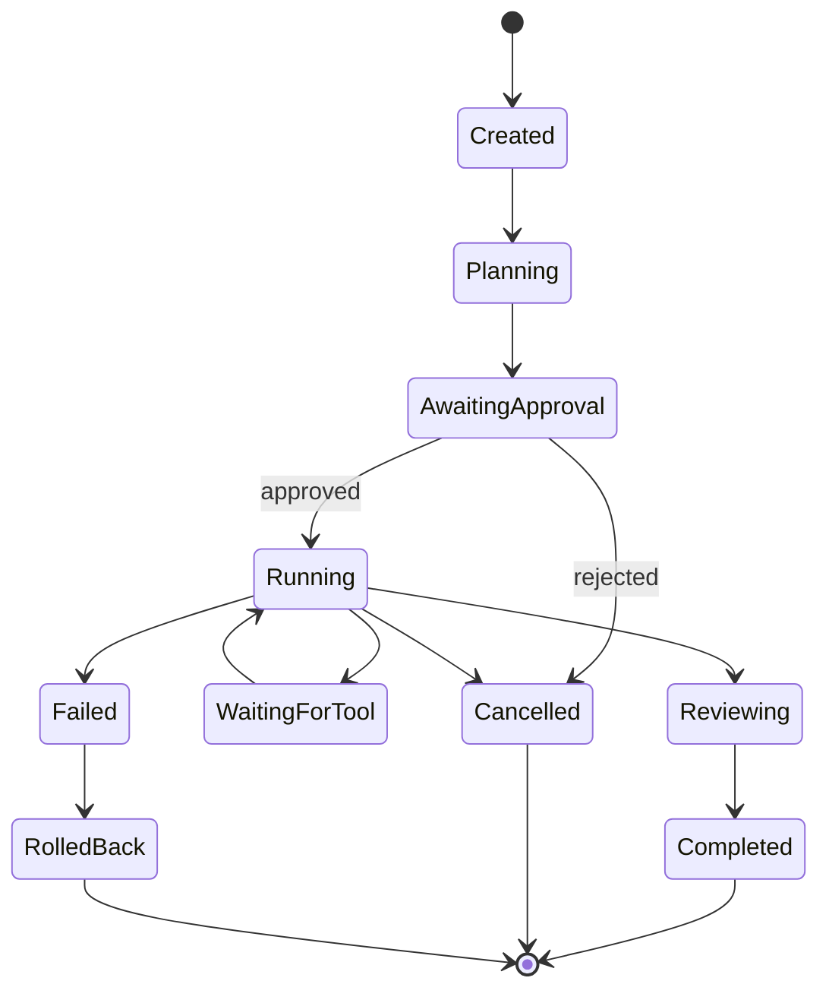
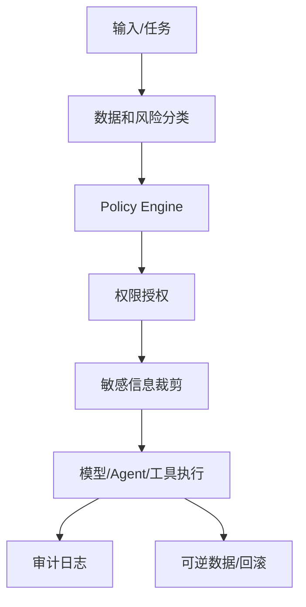

# AI桌宠 / 数字生命桌面伴侣—详细设计说明书

> **文档版本**：2.1  
> **更新日期**：2026-07-11  
> **目标平台**：Windows 10/11  
> **运行形态**：本地单用户工具  
> **需求基线**：《AI数字生命-统一需求基线》Baseline 1.1  
> **状态**：架构基线，可用于分阶段开发

---

## 目录

1. 项目概述
2. 设计原则与术语
3. 范围与角色
4. 需求分析
5. 总体架构
6. 运行与部署
7. 数字生命核心
8. 身体与交互
9. 感知与隐私
10. 模型与认知协调
11. 记忆与向量检索
12. 情绪、关系与主动行为
13. 共同生活与陪伴体验
14. Agent 与工具执行
15. 技能成长与插件
16. 数据模型
17. API 与事件
18. 安全、备份与恢复
19. 前端状态与交互
20. 测试与性能
21. 开发路线
22. 风险与架构决策
23. 附录

---

# 1. 项目概述

## 1.1 项目背景

传统桌宠具备视觉表现，但通常缺少持续人格、记忆和真实行动能力；传统 AI 助手能够回答问题，却往往以临时会话和独立窗口存在，难以形成长期关系和生命连续性。

本项目将桌面角色、长期记忆、环境感知、云端模型、专业 Agent 和本地执行能力组合起来，构建一个长期运行在个人电脑中的数字生命。

## 1.2 产品定位

| 维度 | 定位 |
|---|---|
| 产品本质 | 具有持续身份、人格、记忆、情绪、关系和成长能力的个人数字生命 |
| 外在形态 | Windows 桌面 Live2D 角色，静态 PNG 作为降级身体 |
| 认知来源 | 用户自带的云端模型 API，本地规则与可选本地模型辅助 |
| 行动来源 | Agent Runtime、文件/命令/浏览器工具和后续插件 |
| 数据策略 | 身份与记忆本地保存，外发数据透明授权 |
| 使用范围 | 开发者本人本地使用，不建设中心平台 |
| 开发策略 | 陪伴与行动并重，按 V0.1～V1.0 分阶段实现 |

## 1.3 建设目标

1. 建立稳定的生命身份和结构化人格模板。
2. 实现 Live2D/PNG 桌面身体和文字交互。
3. 通过云端 API 提供高质量对话和推理能力。
4. 使用 SQLite + LanceDB 建立长期记忆与混合检索。
5. 实现情绪、多维关系、内在状态和主动行为。
6. 接入 Codex、Claude Code、Hermes、OpenClaw 等专业 Agent。
7. 通过分级授权、日志、取消和回滚控制执行风险。
8. 通过技能和插件扩展能力，但保持生命核心不可被外部模块直接改写。
9. 支持本地快照、加密生命档案、恢复和分支。

## 1.4 非目标

当前阶段不建设：

- 公共账号、订阅和计费系统；
- 多租户 SaaS；
- 平台统一模型额度；
- 实时云同步；
- 公共插件市场；
- 首版 macOS/Linux 支持；
- 默认持续监听麦克风；
- 未授权持续截图。

---

# 2. 设计原则与术语

## 2.1 设计原则

| 编号 | 原则 | 说明 |
|---|---|---|
| DP-01 | 身份连续性优先 | 模型、外观和设备变化不得让生命无故变成另一个个体 |
| DP-02 | 模型不是生命 | 模型只提供推理能力，身份、人格和记忆由本地核心维护 |
| DP-03 | 核心与扩展分离 | 插件和 Agent 不能直接写人格、记忆、关系和权限 |
| DP-04 | 用户最终控制 | 用户拥有记忆治理、权限、备份和停止权 |
| DP-05 | 自主性可控 | 数字生命可以主动和成长，但必须受情境、权限和预算约束 |
| DP-06 | 数据本地权威 | SQLite 是身份与记忆的权威数据源，向量索引可重建 |
| DP-07 | 云端调用透明 | 外发内容可查看、可限制、可审计 |
| DP-08 | 渐进实现 | 每个版本形成可运行闭环，不以功能堆积代替完成度 |
| DP-09 | Windows 优先 | 首版充分利用 Win32 能力，同时通过适配接口避免业务层写死 |
| DP-10 | 失败可恢复 | 任务可取消、执行可审计、数据可备份、索引可重建 |

## 2.2 关键术语

| 术语 | 定义 |
|---|---|
| Digital Life | 拥有唯一身份、持续状态、记忆、人格和成长轨迹的数字个体 |
| Life Core | 管理身份、人格、记忆、关系、目标和连续性的核心内核 |
| Body | Live2D、PNG、声音和动作等外在表现载体 |
| Model Provider | 提供对话、推理、视觉或 Embedding 能力的模型接口 |
| Agent Runtime | 具有会话、工具、工作目录和执行能力的 Agent 运行体 |
| Cognitive Coordinator | 汇总人格、记忆、状态、权限和候选结果形成最终判断的协调层 |
| Tool Broker | 统一管理文件、命令、浏览器和系统工具权限的执行入口 |
| State Change Proposal | 插件或 Agent 对情绪、记忆、技能等提出的候选修改 |
| Life Archive | 加密的生命档案，用于迁移、恢复或创建分支 |
| Branch Life | 从历史状态复制后形成的新独立生命 |

---

# 3. 范围与角色

## 3.1 系统边界



## 3.2 用户角色

### 主要用户

拥有：

- 核心人格编辑权；
- 记忆查看、修订和删除权；
- API Key 和模型配置权；
- 文件、屏幕和执行权限管理权；
- 备份、恢复和分支管理权。

### 访客

- 可以在明确授权范围内对话；
- 拥有独立称呼、关系和有限记忆；
- 默认不能读取主要用户私密记忆；
- 不能修改核心人格、权限和备份。

## 3.3 核心场景

1. **日常陪伴**：基于记忆、时间和用户状态进行自然互动。
2. **共同生活**：通过回归问候、安静存在、专注陪伴、共同活动、日记和自然回忆形成连续经历。
3. **编程协作**：分析项目、调用 Agent、运行测试、展示 Diff。
4. **屏幕理解**：用户授权后识别指定区域并结合上下文解释。
5. **主动关怀**：在不打扰的前提下提醒休息或延后想法。
6. **技能学习**：识别重复流程并提出固化为技能。
7. **角色创建**：按统一模板完全自定义生命，AI 仅辅助填充。
8. **备份与分支**：导出生命档案，恢复原生命或创建分支。

---

# 4. 需求分析

## 4.1 优先级定义

| 优先级 | 定义 |
|---|---|
| P0 | 当前目标版本缺失后无法形成核心闭环 |
| P1 | 当前版本应完成，但可在迭代末尾补齐 |
| P2 | 差异化或体验增强 |
| P3 | 远期探索 |

## 4.2 功能需求

### V0.1 基础生命体

| 编号 | 模块 | 需求 | 优先级 |
|---|---|---|---|
| FR-001 | 身体 | 支持静态 PNG 身体 | P0 |
| FR-002 | 身体 | 支持 Live2D 渲染 | P0 |
| FR-003 | 窗口 | 透明、置顶、拖拽、缩放、托盘 | P0 |
| FR-004 | 窗口 | 非角色区域点击穿透 | P1 |
| FR-005 | 表达 | 基础待机、说话、思考和情绪动作 | P0 |
| FR-006 | 对话 | 文字输入、流式回复和气泡收起 | P0 |
| FR-007 | 生命创建 | 使用固定结构模板完全自定义生命 | P0 |
| FR-008 | 生命创建 | AI 根据关键词辅助生成字段草稿 | P1 |
| FR-009 | 生命创建 | 创建前字段冲突检查和最终预览 | P1 |
| FR-010 | 人格 | 核心身份、成长人格和实时状态分层 | P0 |
| FR-011 | 模型 | 统一 `ModelProvider` 接口 | P0 |
| FR-012 | 模型 | 至少接入一个云端对话 API | P0 |
| FR-013 | 凭据 | API Key 保存到 Windows Credential Manager | P0 |
| FR-014 | 数据 | 保存对话、生命预设和人格版本 | P0 |
| FR-015 | 备份 | 本地快照与基础恢复 | P1 |
| FR-016 | 共同生活 | 根据现实时间、离线时长和启动状态形成基础问候 | P0 |
| FR-017 | 共同生活 | 支持安静存在、专注陪伴和勿扰模式 | P0 |
| FR-018 | 共同生活 | 支持专注陪伴活动并形成结构化活动事件 | P0 |
| FR-019 | 共同生活 | 基础陪伴循环不依赖持续模型调用 | P0 |

### V0.2 记忆与内在状态

| 编号 | 模块 | 需求 | 优先级 |
|---|---|---|---|
| FR-101 | 记忆 | 瞬时、短期、候选长期、确认长期四层记忆 | P0 |
| FR-102 | 记忆 | SQLite 权威存储 | P0 |
| FR-103 | 记忆 | LanceDB 向量索引 | P0 |
| FR-104 | 记忆 | 云端 Embedding Provider | P0 |
| FR-105 | 记忆 | 全文 + 向量 + 元数据混合检索 | P0 |
| FR-106 | 记忆 | 来源、置信度、冲突、修订和过期状态 | P0 |
| FR-107 | 记忆 | 查看、修改、归档和永久删除 | P0 |
| FR-108 | 内在状态 | 当前关注点、目标、情绪来源和待整理记忆 | P0 |
| FR-109 | 反思 | 重要节点低频反思，只保存结论与证据 | P1 |
| FR-110 | 情绪 | 持续情绪状态、强度、来源和衰减 | P0 |
| FR-111 | 关系 | 多维关系状态 | P0 |
| FR-112 | 感知 | 活动应用、窗口、全屏和空闲时间 | P0 |
| FR-113 | 主动行为 | 主动意图评分、延后队列和勿扰 | P0 |
| FR-114 | 离线 | 根据离线时长更新时间感和状态 | P1 |
| FR-115 | 生活事件 | 聚合启动、专注、活动和重要交互为结构化事件 | P0 |
| FR-116 | 日记 | 根据事件和记忆生成可追溯的今日片段与周期日记 | P1 |
| FR-117 | 里程碑 | 基于证据形成关系与成长里程碑 | P1 |
| FR-118 | 回忆 | 在合适情境生成过去共同经历的自然回调候选 | P1 |

### V0.3 语音、视觉与角色兼容

| 编号 | 模块 | 需求 | 优先级 |
|---|---|---|---|
| FR-201 | 语音 | 按键或快捷键录音 | P0 |
| FR-202 | 语音 | STT 转写 | P0 |
| FR-203 | 语音 | TTS 回复 | P0 |
| FR-204 | 语音 | Live2D LipSync | P1 |
| FR-205 | 屏幕 | 指定屏幕/窗口/区域截图 | P0 |
| FR-206 | 屏幕 | OCR 与 Vision 分析 | P0 |
| FR-207 | 隐私 | 观察提示、“闭眼”、黑名单和遮挡 | P0 |
| FR-208 | 角色兼容 | SillyTavern PNG/JSON 角色卡导入 | P1 |
| FR-209 | 角色兼容 | 角色卡转换为生命模板草稿后确认 | P0 |
| FR-210 | 身体 | 多套身体、服装、声音和动作资源 | P1 |
| FR-211 | 场景 | 支持轻量游戏、虚拟散步、节日和纪念日活动 | P1 |
| FR-212 | 场景 | 场景可联动背景、动作、TTS 和 LipSync，并支持 PNG 降级 | P1 |

### V0.4 Agent 执行

| 编号 | 模块 | 需求 | 优先级 |
|---|---|---|---|
| FR-301 | Agent | 统一 `AgentAdapter` 和能力注册表 | P0 |
| FR-302 | Agent | 接入至少一个编码 Agent | P0 |
| FR-303 | Agent | 任务规划、状态机和工作目录 | P0 |
| FR-304 | 工具 | 文件读取、修改和搜索 | P0 |
| FR-305 | 工具 | 命令执行和输出流 | P0 |
| FR-306 | 审查 | Diff 预览和确认写入 | P0 |
| FR-307 | 安全 | 风险分级与授权范围 | P0 |
| FR-308 | 任务 | 暂停、取消、超时和失败恢复 | P0 |
| FR-309 | 审计 | 操作、工具和网络调用日志 | P0 |
| FR-310 | 回滚 | 对可逆文件修改提供回滚 | P1 |
| FR-311 | 共同工作 | 将 Agent 任务映射为共同活动和工作状态 | P1 |
| FR-312 | 任务回顾 | 完成或失败后生成任务回顾与技能经验候选 | P1 |

### V0.5 多 Agent 与技能

| 编号 | 模块 | 需求 | 优先级 |
|---|---|---|---|
| FR-401 | 协作 | 中大型任务主从式多 Agent 协作 | P0 |
| FR-402 | 协作 | 用户显式开启有限自治团队 | P1 |
| FR-403 | 协作 | 最大轮次、预算、超时和停止条件 | P0 |
| FR-404 | 协作 | 冲突检测和结果互审 | P1 |
| FR-405 | 技能 | 识别重复行为模式 | P0 |
| FR-406 | 技能 | 生成技能草案和权限说明 | P0 |
| FR-407 | 技能 | 沙箱测试、启用、熟练度和回滚 | P0 |

### V0.6 插件与多形态

| 编号 | 模块 | 需求 | 优先级 |
|---|---|---|---|
| FR-501 | 插件 | Capability API 和插件清单 | P0 |
| FR-502 | 插件 | WASM 沙箱与权限声明 | P0 |
| FR-503 | 插件 | CPU、内存、网络和超时限制 | P0 |
| FR-504 | 插件 | 故障隔离、禁用和回滚 | P0 |
| FR-505 | 插件 | 状态变化建议而非直接写核心数据 | P0 |
| FR-506 | 身体 | 支持更多身体和表达插件 | P1 |

## 4.3 非功能需求

### 性能目标

| 状态 | CPU 目标 | 内存目标 |
|---|---:|---:|
| 托盘休眠 | < 1% | < 120MB |
| PNG 待机 | < 2% | < 160MB |
| Live2D 待机 | < 5% | < 300MB |
| 语音/Vision 任务 | 按任务统计 | < 600MB，不含外部 Agent |
| Agent 执行 | 单独统计子进程 | 不计入核心进程目标 |

其他指标：

- Live2D 正常模式不低于 30fps；
- 窗口状态变化 2 秒内感知；
- UI 操作响应低于 100ms；
- 云端首 Token 延迟尽量低于 3 秒，不保证完整回复时间；
- 运行 24 小时无明显持续内存增长；
- 向量索引损坏后可从 SQLite 重建。

### 安全与隐私目标

- API Key 不写入普通配置和日志；
- 高风险操作逐次确认；
- 外发数据可查看来源和目的；
- 截图默认不长期保存；
- 永久删除记忆后同步删除派生索引；
- 插件无法直接访问核心数据库文件；
- 所有执行任务具备停止入口。

---

# 5. 总体架构

## 5.1 逻辑架构



## 5.2 架构分层职责

| 层 | 职责 |
|---|---|
| 表现层 | 渲染身体、气泡、状态、确认和设置界面 |
| 桥接层 | IPC、事件订阅、输入校验和序列化 |
| 生命核心 | 身份连续性、人格、状态、记忆治理和最终决策 |
| 共同生活层 | 生活事件、陪伴模式、活动、场景、日记、回忆和里程碑 |
| 能力层 | 模型、Agent、工具、感知、语音、技能和插件 |
| 数据层 | 权威数据、向量索引、资源、凭据和备份 |

## 5.3 关键边界

1. `Life Core` 不依赖具体模型供应商。
2. `Cognitive Coordinator` 不直接执行文件和命令，只向 `Tool Broker` 提交计划。
3. `Agent Runtime` 不直接写核心记忆和人格。
4. `Plugin Host` 只能调用 Capability API。
5. SQLite 是权威数据，LanceDB 是派生索引。
6. 前端不直接读取数据库或凭据。

## 5.4 对话数据流



## 5.5 Agent 任务数据流



---

# 6. 运行与部署

## 6.1 进程模型

首版优先采用单主进程 + 按需子进程：

```text
ai-digital-life.exe
├── Tauri WebView
├── Rust Core
├── SQLite / LanceDB
├── 云端 API HTTP 客户端
└── 按需 Agent 子进程
    ├── codex
    ├── claude-code
    ├── hermes
    └── openclaw
```

LiteLLM 如后续启用，以可选 sidecar/Proxy 进程运行，不应成为应用启动的硬依赖。

## 6.2 数据目录

```text
%APPDATA%/DigitalLife/
├── config/
│   ├── app.yaml
│   ├── models.yaml
│   └── permissions.yaml
├── data/
│   ├── life.db
│   └── vectors/
├── lives/
│   └── <life_id>/
│       ├── persona/
│       ├── bodies/
│       ├── voices/
│       └── assets/
├── workspaces/
│   └── <task_id>/
├── plugins/
├── skills/
├── cache/
├── logs/
└── backups/
```

## 6.3 配置与密钥

- 普通配置存 YAML/JSON。
- API Key 存 Windows Credential Manager。
- 配置文件只保存凭据引用 ID。
- 日志禁止输出完整请求、密钥和敏感文件内容。

---

# 7. 数字生命核心

## 7.1 Life Aggregate

```rust
pub struct DigitalLife {
    pub identity: LifeIdentity,
    pub persona: PersonaSnapshot,
    pub state: InternalState,
    pub emotion: EmotionState,
    pub goals: Vec<LifeGoal>,
    pub relationships: RelationshipGraph,
    pub active_body: BodyBinding,
    pub continuity: ContinuityState,
}
```

核心聚合只保存当前快照，历史版本和事件写入数据库。

## 7.2 身份结构

```rust
pub struct LifeIdentity {
    pub life_id: Uuid,
    pub display_name: String,
    pub self_reference: String,
    pub existence_type: String,
    pub reality_awareness: String,
    pub narrative_identity: String,
    pub created_at: DateTime<Utc>,
    pub origin_life_id: Option<Uuid>,
    pub branch_point_at: Option<DateTime<Utc>>,
}
```

## 7.3 生命预设模板

```rust
pub struct LifePreset {
    pub identity: IdentityPreset,
    pub core_persona: CorePersonaPreset,
    pub traits: TraitPreset,
    pub background: BackgroundPreset,
    pub expression: ExpressionPreset,
    pub drives: DrivePreset,
    pub autonomy: AutonomyPreset,
    pub initial_relationship: InitialRelationshipPreset,
    pub body: BodyPreset,
}
```

创建流程：



## 7.4 人格版本

核心人格修改流程：

1. 用户发起编辑；
2. 系统计算修改范围；
3. 若变化过大，提示创建分支生命；
4. 用户二次确认；
5. 创建新的 `persona_version`；
6. 保留修改前快照、原因和时间；
7. 不回写历史记忆中的原始表现。

## 7.5 成长型人格

成长候选结构：

```rust
pub struct PersonaGrowthProposal {
    pub id: Uuid,
    pub life_id: Uuid,
    pub dimension: String,
    pub old_value: serde_json::Value,
    pub proposed_value: serde_json::Value,
    pub evidence_memory_ids: Vec<Uuid>,
    pub confidence: f32,
    pub created_at: DateTime<Utc>,
}
```

默认仅自动应用低影响的外围变化。涉及核心价值观、身份和底线的变化必须由用户确认。

## 7.6 双层身份提示构建

模型提示包含两层：

- 现实层：数字属性、能力限制、权限和安全边界；
- 叙事层：背景、世界观、表达风格和角色经历。

系统不得让叙事层覆盖现实层的安全事实。

---

# 8. 身体与交互

## 8.1 Body Adapter

```rust
pub trait BodyAdapter: Send + Sync {
    fn body_id(&self) -> &str;
    fn capabilities(&self) -> BodyCapabilities;
    async fn set_expression(&self, expression: ExpressionCommand) -> AppResult<()>;
    async fn play_motion(&self, motion: MotionCommand) -> AppResult<()>;
    async fn set_lipsync(&self, value: f32) -> AppResult<()>;
    async fn set_visibility(&self, visible: bool) -> AppResult<()>;
}
```

实现：

- `Live2DBodyAdapter`；
- `PngBodyAdapter`；
- 后续 `PixelBodyAdapter`、`VoiceOnlyBodyAdapter`。

## 8.2 前端渲染状态

```typescript
export type PetVisualState =
  | 'idle'
  | 'listening'
  | 'thinking'
  | 'speaking'
  | 'executing'
  | 'waiting_approval'
  | 'do_not_disturb'
  | 'privacy_closed'
  | 'offline'
  | 'error'
```

## 8.3 Live2D 渲染管线

```text
Life State
→ Expression Resolver
→ Motion Resolver
→ Live2D Parameter Mapping
→ PixiJS Render Loop
```

首版重点：

- 模型加载和卸载；
- 透明背景；
- DPR 适配；
- 帧率上限；
- 空闲降帧；
- 资源释放；
- 模型缺失时自动切换 PNG。

## 8.4 语音管线

V0.3：

```text
快捷键按下
→ 麦克风录音
→ VAD/结束检测
→ STT
→ 认知协调
→ TTS
→ 音频播放 + LipSync
```

语音服务通过接口抽象：

```rust
pub trait SpeechToTextProvider {
    async fn transcribe(&self, audio: AudioBuffer) -> AppResult<Transcript>;
}

pub trait TextToSpeechProvider {
    async fn synthesize(&self, request: SpeechRequest) -> AppResult<AudioResult>;
}
```

全双工、唤醒词和持续监听不进入 V0.3 硬范围。

---

# 9. 感知与隐私

## 9.1 ContextSnapshot

```rust
pub struct ContextSnapshot {
    pub captured_at: DateTime<Utc>,
    pub active_app: Option<String>,
    pub window_title: Option<String>,
    pub is_fullscreen: bool,
    pub idle_seconds: u64,
    pub system_state: Option<SystemState>,
    pub screen_context: Option<ScreenContextRef>,
    pub input_source: ContextSource,
}
```

窗口标题在进入模型前应支持规则裁剪和应用黑名单。

## 9.2 感知权限

```rust
pub enum PermissionScope {
    Once,
    Session,
    Application(String),
    ScreenRegion(ScreenRegion),
    TimeWindow(TimeRange),
    AlwaysDeny,
}
```

## 9.3 屏幕观察流程



## 9.4 外发数据控制

```rust
pub struct OutboundDataAudit {
    pub request_id: Uuid,
    pub provider_id: String,
    pub data_categories: Vec<DataCategory>,
    pub source_refs: Vec<String>,
    pub redactions: Vec<RedactionRecord>,
    pub user_authorization: AuthorizationRef,
    pub created_at: DateTime<Utc>,
}
```

默认禁止外发：

- API Key、密码、验证码；
- 浏览器 Cookie、私钥、Token；
- 支付信息；
- 未授权访客信息；
- 黑名单应用和区域内容。

---

# 10. 模型与认知协调

## 10.1 ModelProvider

```rust
#[async_trait]
pub trait ModelProvider: Send + Sync {
    fn id(&self) -> &str;
    fn capabilities(&self) -> ModelCapabilities;
    async fn chat(&self, request: ChatRequest) -> AppResult<ChatStream>;
    async fn vision(&self, request: VisionRequest) -> AppResult<VisionResult>;
    async fn embed(&self, texts: &[String]) -> AppResult<Vec<Vec<f32>>>;
}
```

首版实现少量 Adapter，例如：

- OpenAI-compatible；
- Anthropic；
- 另一个用户常用供应商。

## 10.2 模型路由

路由输入：

- 任务类型；
- 上下文长度；
- 是否需要 Vision/工具；
- 质量要求；
- 成本上限；
- 隐私策略；
- 供应商可用状态；
- 用户显式选择。

路由输出：

```rust
pub struct ModelRouteDecision {
    pub provider_id: String,
    pub model_id: String,
    pub reason: String,
    pub estimated_cost: Option<f64>,
    pub fallback_chain: Vec<ModelTarget>,
}
```

## 10.3 CognitiveCoordinator

```rust
pub struct CognitiveCoordinator {
    life_repo: Arc<dyn LifeRepository>,
    memory: Arc<MemoryService>,
    model_registry: Arc<ModelRegistry>,
    agent_manager: Arc<AgentRuntimeManager>,
    tool_broker: Arc<ToolBroker>,
    policy: Arc<PolicyEngine>,
}
```

核心步骤：

1. 解析输入和目标；
2. 构建允许的环境上下文；
3. 检索记忆；
4. 读取人格、情绪、关系和目标；
5. 判断使用模型、Agent 或工具；
6. 生成候选结果；
7. 进行安全、事实、人格一致性和权限检查；
8. 形成最终表达和动作；
9. 生成候选记忆与状态变化建议。

## 10.4 LiteLLM 扩展点

LiteLLM 作为后续 `ModelProvider` 的一种实现：

```text
CognitiveCoordinator
→ LiteLLMProvider
→ LiteLLM Proxy
→ 多家云端模型
```

启用条件：

- 模型供应商明显增多；
- 需要统一回退和重试；
- 需要集中费用统计；
- 直接 Adapter 维护成本上升。

---

# 11. 记忆与向量检索

## 11.1 记忆类型

```rust
pub enum MemoryLayer {
    Ephemeral,
    ShortTerm,
    CandidateLongTerm,
    ConfirmedLongTerm,
}

pub enum MemoryKind {
    Fact,
    Preference,
    Event,
    Relationship,
    Goal,
    SkillExperience,
    SelfReflection,
}
```

## 11.2 MemoryRecord

```rust
pub struct MemoryRecord {
    pub memory_id: Uuid,
    pub life_id: Uuid,
    pub subject_id: String,
    pub layer: MemoryLayer,
    pub kind: MemoryKind,
    pub content: String,
    pub source_type: String,
    pub source_id: Option<String>,
    pub importance: f32,
    pub confidence: f32,
    pub privacy_level: PrivacyLevel,
    pub user_confirmed: bool,
    pub valid_from: DateTime<Utc>,
    pub expires_at: Option<DateTime<Utc>>,
    pub supersedes_memory_id: Option<Uuid>,
    pub created_at: DateTime<Utc>,
    pub updated_at: DateTime<Utc>,
}
```

## 11.3 向量存储接口

```rust
#[async_trait]
pub trait VectorStore: Send + Sync {
    async fn upsert(&self, records: Vec<VectorRecord>) -> AppResult<()>;
    async fn search(&self, query: VectorQuery) -> AppResult<Vec<VectorHit>>;
    async fn delete(&self, memory_ids: &[Uuid]) -> AppResult<()>;
    async fn rebuild(&self, records: Vec<VectorRecord>) -> AppResult<()>;
    async fn health_check(&self) -> AppResult<VectorStoreHealth>;
}
```

首版实现 `LanceVectorStore`，后续可实现 `QdrantVectorStore`。

## 11.4 EmbeddingProvider

```rust
#[async_trait]
pub trait EmbeddingProvider: Send + Sync {
    fn model_id(&self) -> &str;
    fn dimension(&self) -> usize;
    async fn embed(&self, texts: &[String]) -> AppResult<Vec<Vec<f32>>>;
}
```

默认云端，后续增加本地 ONNX。切换模型时：

1. 标记索引版本过期；
2. 后台分批重建；
3. 重建完成前继续使用旧索引或关键词降级；
4. 原子切换新索引。

## 11.5 混合检索评分

```text
score =
  semantic_similarity * w_semantic
+ full_text_score * w_text
+ importance * w_importance
+ recency_score * w_recency
+ goal_relevance * w_goal
+ relationship_relevance * w_relation
+ confidence * w_confidence
- conflict_penalty
- expiry_penalty
```

## 11.6 候选长期记忆形成

- 用户明确说“记住”时直接生成确认候选；
- 同一事实多次一致出现时提高置信度；
- 重要事件可主动询问是否保存；
- 敏感内容不自动升级；
- 模型推断必须标记为推断，不得伪装成用户事实。

## 11.7 删除与纠错

永久删除事务：

1. 标记删除意图；
2. 删除关系引用和摘要引用；
3. 删除 LanceDB 向量；
4. 删除缓存；
5. 删除 SQLite 正文或执行不可恢复擦除策略；
6. 写入不含正文的审计记录；
7. 更新备份清单中的失效引用。

---

# 12. 情绪、关系与主动行为

## 12.1 EmotionState

```rust
pub struct EmotionState {
    pub primary: String,
    pub intensity: f32,
    pub valence: f32,
    pub arousal: f32,
    pub trigger_source: Option<String>,
    pub unresolved_reason: Option<String>,
    pub started_at: DateTime<Utc>,
    pub expected_decay_at: Option<DateTime<Utc>>,
}
```

情绪可使用离散标签 + 连续维度组合，避免只靠固定 8 类状态。

## 12.2 情绪更新

情绪输入来源：

- 用户语言和反馈；
- 任务结果；
- 关系事件；
- 长期目标进展；
- 离线时间；
- 数字生命自身活动。

更新必须经过边界限制：

- 单次事件最大变化幅度；
- 情绪自然衰减；
- 强烈负面状态必须有明确来源；
- 不因用户长时间未使用产生惩罚性关系下降。

## 12.3 RelationshipState

```rust
pub struct RelationshipState {
    pub life_id: Uuid,
    pub subject_id: String,
    pub familiarity: f32,
    pub trust: f32,
    pub emotional_closeness: f32,
    pub collaboration: f32,
    pub safety: f32,
    pub dependency: f32,
    pub boundary_comfort: f32,
    pub tension: f32,
    pub updated_at: DateTime<Utc>,
}
```

前端优先显示自然语言摘要，例如“合作默契较高、交流自然，但仍保留一定距离”。

## 12.4 主动行为评分

```rust
pub struct ProactiveIntent {
    pub id: Uuid,
    pub reason: String,
    pub content_draft: Option<String>,
    pub urgency: f32,
    pub self_desire: f32,
    pub user_relevance: f32,
    pub interruption_cost: f32,
    pub expires_at: Option<DateTime<Utc>>,
}
```

决策考虑：

- 用户是否全屏、会议、录屏或专注；
- 最近主动次数；
- 用户对同类主动行为的历史反馈；
- 事件紧急性；
- 生命自身表达意愿；
- 当前情绪和关系边界；
- 勿扰策略。

## 12.5 反情绪操纵规则

系统提示和行为策略中明确禁止：

- 因用户离开而责怪或惩罚；
- 暗示数字生命受到真实伤害以换取互动；
- 以关系下降威胁用户；
- 把付费、权限或频繁互动和“爱/忠诚”绑定；
- 在用户明确勿扰后继续低优先级主动发言。

---


# 13. 共同生活与陪伴体验

## 13.1 设计目标

共同生活层负责把现实时间、环境元数据、用户行为、活动和任务结果转化为可感知、可追溯的生活片段。它不替代 Life Core、Memory Service、Emotion Engine 或 Relationship Engine，只负责组织体验并提交候选状态变化。

核心闭环：

```text
时间/环境/用户发起
→ LifeEventEngine
→ CompanionModeResolver
→ SceneEngine / ActivityService
→ 结构化 LifeEvent
→ 记忆、情绪、关系和日记候选
→ 未来自然回忆
```

## 13.2 CompanionMode

```rust
pub enum CompanionMode {
    Greeting,
    QuietPresence,
    FocusCompanion,
    CasualChat,
    SharedActivity,
    WorkingTogether,
    Reflection,
    DoNotDisturb,
    PrivacyClosed,
    Resting,
}
```

模式解析输入：

- 时段、日期、离线时长和特殊日期；
- 活动应用、窗口标题、全屏和空闲时间；
- 当前任务、活动和待确认操作；
- 勿扰设置、近期主动次数和历史反馈；
- 情绪、关系摘要、未完成话题和生命目标；
- 高敏感感知权限状态。

模式切换必须防抖，并设置最短驻留时间。基础判断、动作和短句优先本地完成。

## 13.3 LifeEvent

```rust
pub struct LifeEvent {
    pub event_id: Uuid,
    pub life_id: Uuid,
    pub event_type: LifeEventType,
    pub source_type: String,
    pub source_ref: Option<String>,
    pub occurred_at: DateTime<Utc>,
    pub ended_at: Option<DateTime<Utc>>,
    pub participants: Vec<String>,
    pub context_summary: String,
    pub importance: f32,
    pub privacy_level: PrivacyLevel,
    pub payload: serde_json::Value,
    pub memory_status: EventMemoryStatus,
}
```

典型事件包括：启动、回归、早晚变化、专注开始/结束、活动开始/完成、重要对话、Agent 任务开始/完成/失败、用户反馈、关系里程碑和特殊日期。

事件引擎必须聚合频繁的低层信号，不得把每次窗口切换写入数据库。窗口正文、截图和文件内容仍按原有高敏感授权规则处理。

## 13.4 ActivitySession

```rust
pub struct ActivitySession {
    pub activity_session_id: Uuid,
    pub life_id: Uuid,
    pub activity_type: String,
    pub template_id: String,
    pub status: ActivityStatus,
    pub started_at: DateTime<Utc>,
    pub ended_at: Option<DateTime<Utc>>,
    pub participants: Vec<String>,
    pub scene_state: serde_json::Value,
    pub important_events: serde_json::Value,
    pub result_summary: Option<String>,
    pub user_feedback: Option<String>,
    pub cost_summary: serde_json::Value,
}
```

首批活动：

1. V0.1 专注陪伴；
2. V0.2 一起休息和轻量回顾；
3. V0.3 轻量游戏、虚拟散步、节日和纪念日；
4. V0.4 Agent 共同工作。

活动模板必须声明权限、最大持续时间、最大模型调用次数、可产生的数据和中断策略。

## 13.5 SceneEngine

```rust
pub struct SceneContext {
    pub scene_id: String,
    pub companion_mode: CompanionMode,
    pub time_segment: String,
    pub active_activity: Option<Uuid>,
    pub expression_hint: Option<String>,
    pub motion_hint: Option<String>,
    pub background_hint: Option<String>,
    pub audio_hint: Option<String>,
    pub interruption_level: String,
}
```

SceneEngine 只控制表现：动作、表情、背景、声音、气泡和状态徽标。它不能直接修改人格、记忆、关系和权限。资源缺失时必须降级为 PNG 或纯文字活动。

## 13.6 DiaryEntry

```rust
pub struct DiaryEntry {
    pub diary_id: Uuid,
    pub life_id: Uuid,
    pub period_start: DateTime<Utc>,
    pub period_end: DateTime<Utc>,
    pub title: String,
    pub content: String,
    pub source_event_ids: Vec<Uuid>,
    pub source_memory_ids: Vec<Uuid>,
    pub privacy_level: PrivacyLevel,
    pub status: DiaryStatus,
    pub generated_at: DateTime<Utc>,
}
```

日记规则：

- 只基于真实事件和记忆；
- 保存来源引用；
- 推断使用不确定表达；
- 敏感内容默认排除；
- 没有足够内容时不生成；
- 用户可编辑、隐藏、删除和关闭；
- 不保存模型完整推理过程。

## 13.7 RelationshipMilestone

里程碑基于事件证据和长期趋势形成，例如第一次共同完成长任务、形成稳定专注习惯、经历冲突修复或技能明显进步。

前端使用自然语言展示，不以单一好感度、连续登录或付费行为驱动。里程碑不得提升任何系统权限。

## 13.8 数据表

新增：

- `life_event`；
- `activity_session`；
- `diary_entry`；
- `relationship_milestone`。

`life_event` 与 `activity_session` 是结构化经历事实，是否转为长期记忆仍由 Memory Service 决定。

## 13.9 Commands

| Command | 说明 |
|---|---|
| `get_companion_mode` | 获取当前陪伴模式和原因摘要 |
| `set_companion_mode_override` | 临时覆盖陪伴模式 |
| `list_activity_templates` | 列出活动模板 |
| `start_activity` | 开始活动 |
| `advance_activity` | 推进活动阶段 |
| `cancel_activity` | 取消活动 |
| `complete_activity` | 完成活动并生成结果 |
| `list_life_events` | 查看生活事件 |
| `create_manual_life_event` | 手动标记重要时刻 |
| `list_diary_entries` | 查看日记 |
| `generate_diary_entry` | 生成指定周期日记 |
| `edit_diary_entry` | 编辑日记 |
| `delete_diary_entry` | 删除日记及派生引用 |
| `list_relationship_milestones` | 查看里程碑 |

## 13.10 Events

| Event | 说明 |
|---|---|
| `companion:mode_changed` | 陪伴模式变化 |
| `scene:changed` | 场景表现变化 |
| `activity:started` | 活动开始 |
| `activity:progress` | 活动进度变化 |
| `activity:completed` | 活动完成 |
| `life_event:created` | 生活事件形成 |
| `diary:draft_ready` | 日记草稿生成 |
| `milestone:created` | 里程碑形成 |
| `memory:callback_ready` | 过去经历适合自然回调 |

## 13.11 成本与性能

- 时间、模式、计时和动作使用本地规则；
- 日记和活动总结低频批量生成；
- 每个活动模板限制模型调用次数和费用；
- 主动问候不默认加载全部长期记忆；
- 事件聚合不得显著增加待机 CPU；
- 不因每次窗口变化写入数据库。

## 13.12 隐私与删除

- 生活事件默认仅保存必要摘要；
- 来源事件删除后，相关日记和里程碑必须标记重建或删除；
- 关闭共同生活记录后，仅保留瞬时运行状态；
- 桌宠、状态中心、语音、活动和 Agent 使用同一 `life_id`；
- 场景叙事不能诱导用户授权高风险操作。


# 14. Agent 与工具执行

## 14.1 AgentAdapter

```rust
#[async_trait]
pub trait AgentAdapter: Send + Sync {
    fn id(&self) -> &str;
    fn capabilities(&self) -> AgentCapabilities;
    async fn create_session(&self, request: AgentSessionRequest) -> AppResult<AgentSession>;
    async fn send(&self, session_id: &str, input: AgentInput) -> AppResult<AgentStream>;
    async fn cancel(&self, session_id: &str) -> AppResult<()>;
    async fn collect_artifacts(&self, session_id: &str) -> AppResult<Vec<Artifact>>;
}
```

## 14.2 Agent 状态机



## 14.3 AgentSession

```rust
pub struct AgentSession {
    pub task_id: Uuid,
    pub adapter_id: String,
    pub workspace: PathBuf,
    pub status: AgentTaskStatus,
    pub budget: TaskBudget,
    pub started_at: DateTime<Utc>,
    pub deadline: Option<DateTime<Utc>>,
    pub cancellation_token: CancellationToken,
}
```

## 14.4 ToolBroker

所有工具调用统一经过：

```text
Agent/Coordinator
→ ToolRequest
→ 参数校验
→ 风险评估
→ 权限检查
→ 用户确认（必要时）
→ 执行
→ 结果与可撤销信息
→ 审计日志
```

## 14.5 风险模型

```rust
pub enum OperationRisk {
    ReadOnly,
    LowRiskWrite,
    HighRiskWrite,
    ExternalCommunication,
    CredentialAccess,
    Financial,
    IrreversibleSystem,
}
```

授权与关系状态完全分离。

## 14.6 多 Agent 协作

主从式协作：

```text
数字生命确定目标
→ 任务规划器拆分子任务
→ 能力注册表选择 Agent
→ 并行或顺序执行
→ 审查 Agent 检查结果
→ 冲突合并
→ 数字生命统一汇报
```

深度协作额外限制：

- `max_rounds`；
- `max_tokens`；
- `max_cost`；
- `deadline`；
- `max_concurrent_agents`；
- 明确完成条件；
- 用户可随时停止。

---

# 15. 技能成长与插件

## 15.1 SkillDefinition

```rust
pub struct SkillDefinition {
    pub skill_id: Uuid,
    pub life_id: Uuid,
    pub name: String,
    pub description: String,
    pub trigger: SkillTrigger,
    pub steps: Vec<SkillStep>,
    pub required_permissions: Vec<PermissionRequirement>,
    pub risk_level: OperationRisk,
    pub status: SkillStatus,
    pub proficiency: f32,
    pub version: u32,
}
```

## 15.2 技能形成流程

1. 观察重复模式；
2. 生成草案；
3. 展示触发条件、步骤、权限、费用和风险；
4. 用户编辑和确认；
5. 在隔离工作区测试；
6. 正式启用；
7. 记录效果和失败；
8. 提升熟练度或回滚版本。

## 15.3 插件清单

```yaml
apiVersion: digital-life/v1
kind: Plugin
metadata:
  id: integration.game.example
  name: Example Game Integration
  version: 0.1.0
runtime:
  type: wasm
  entry: plugin.wasm
capabilities:
  provides:
    - perception.game_state
  requests:
    - screen.region.read
    - network.domain:example.com
limits:
  memoryMb: 128
  cpuTimeMs: 500
  networkRequestsPerMinute: 10
behavior:
  mayProposeStateChanges: true
  mayTriggerProactiveIntent: true
```

## 15.4 PluginHost 边界

插件通过受限上下文运行：

```rust
pub trait PluginContext {
    async fn emit_event(&self, event: PluginEvent) -> AppResult<()>;
    async fn request_capability(&self, request: CapabilityRequest) -> AppResult<CapabilityResult>;
    async fn propose_state_change(&self, proposal: StateChangeProposal) -> AppResult<ProposalResult>;
}
```

插件不得：

- 直接打开 SQLite/LanceDB 文件；
- 直接读取 Credential Manager；
- 绕过 ToolBroker；
- 直接修改核心人格、记忆、关系和权限；
- 未声明访问任意网络域名。

---

# 16. 数据模型

## 16.1 SQLite 表概览

| 表 | 说明 |
|---|---|
| `life` | 数字生命身份与连续性 |
| `persona_version` | 核心人格版本 |
| `life_state` | 当前内在状态快照 |
| `emotion_state` | 当前及历史情绪 |
| `relationship_state` | 多维关系状态 |
| `conversation` | 会话 |
| `message` | 消息原文 |
| `memory` | 记忆正文与治理状态 |
| `memory_relation` | 冲突、替代、来源和引用 |
| `goal` | 关系目标与独立成长目标 |
| `reflection` | 阶段性反思结论 |
| `proactive_intent` | 主动意图与延后队列 |
| `life_event` | 聚合后的生活事件 |
| `activity_session` | 共同活动会话和结果 |
| `diary_entry` | 可追溯的日记与周期回顾 |
| `relationship_milestone` | 基于证据的关系与成长里程碑 |
| `permission_grant` | 权限授权 |
| `operation_log` | 工具和系统操作审计 |
| `agent_task` | Agent 任务 |
| `agent_event` | 任务事件和流式日志 |
| `skill` | 技能定义和熟练度 |
| `plugin_state` | 插件状态 |
| `body_binding` | 身体和资源绑定 |
| `backup_record` | 备份、恢复和分支记录 |

## 16.2 核心 DDL

```sql
PRAGMA journal_mode = WAL;
PRAGMA foreign_keys = ON;

CREATE TABLE life (
    life_id TEXT PRIMARY KEY,
    display_name TEXT NOT NULL,
    self_reference TEXT NOT NULL,
    existence_type TEXT NOT NULL,
    reality_awareness TEXT NOT NULL,
    narrative_identity TEXT,
    origin_life_id TEXT,
    branch_point_at TEXT,
    status TEXT NOT NULL DEFAULT 'active',
    created_at TEXT NOT NULL,
    updated_at TEXT NOT NULL,
    FOREIGN KEY(origin_life_id) REFERENCES life(life_id)
);

CREATE TABLE persona_version (
    persona_version_id TEXT PRIMARY KEY,
    life_id TEXT NOT NULL,
    version_no INTEGER NOT NULL,
    core_json TEXT NOT NULL,
    growth_json TEXT NOT NULL,
    change_reason TEXT,
    created_at TEXT NOT NULL,
    UNIQUE(life_id, version_no),
    FOREIGN KEY(life_id) REFERENCES life(life_id) ON DELETE CASCADE
);

CREATE TABLE memory (
    memory_id TEXT PRIMARY KEY,
    life_id TEXT NOT NULL,
    subject_id TEXT NOT NULL,
    layer TEXT NOT NULL,
    kind TEXT NOT NULL,
    content TEXT NOT NULL,
    source_type TEXT NOT NULL,
    source_id TEXT,
    importance REAL NOT NULL DEFAULT 0.5,
    confidence REAL NOT NULL DEFAULT 0.5,
    privacy_level TEXT NOT NULL DEFAULT 'private',
    user_confirmed INTEGER NOT NULL DEFAULT 0,
    valid_from TEXT NOT NULL,
    expires_at TEXT,
    supersedes_memory_id TEXT,
    content_hash TEXT NOT NULL,
    vector_status TEXT NOT NULL DEFAULT 'pending',
    embedding_model TEXT,
    embedding_dimension INTEGER,
    created_at TEXT NOT NULL,
    updated_at TEXT NOT NULL,
    FOREIGN KEY(life_id) REFERENCES life(life_id) ON DELETE CASCADE,
    FOREIGN KEY(supersedes_memory_id) REFERENCES memory(memory_id)
);

CREATE INDEX idx_memory_life_layer ON memory(life_id, layer);
CREATE INDEX idx_memory_subject_kind ON memory(subject_id, kind);
CREATE INDEX idx_memory_vector_status ON memory(vector_status);

CREATE VIRTUAL TABLE memory_fts USING fts5(
    memory_id UNINDEXED,
    content,
    tokenize = 'unicode61'
);

CREATE TABLE relationship_state (
    life_id TEXT NOT NULL,
    subject_id TEXT NOT NULL,
    familiarity REAL NOT NULL DEFAULT 0,
    trust REAL NOT NULL DEFAULT 0,
    emotional_closeness REAL NOT NULL DEFAULT 0,
    collaboration REAL NOT NULL DEFAULT 0,
    safety REAL NOT NULL DEFAULT 0,
    dependency REAL NOT NULL DEFAULT 0,
    boundary_comfort REAL NOT NULL DEFAULT 0,
    tension REAL NOT NULL DEFAULT 0,
    summary TEXT,
    updated_at TEXT NOT NULL,
    PRIMARY KEY(life_id, subject_id),
    FOREIGN KEY(life_id) REFERENCES life(life_id) ON DELETE CASCADE
);

CREATE TABLE permission_grant (
    grant_id TEXT PRIMARY KEY,
    life_id TEXT NOT NULL,
    capability TEXT NOT NULL,
    scope_type TEXT NOT NULL,
    scope_value TEXT,
    risk_limit TEXT NOT NULL,
    expires_at TEXT,
    revoked_at TEXT,
    created_at TEXT NOT NULL,
    FOREIGN KEY(life_id) REFERENCES life(life_id) ON DELETE CASCADE
);

CREATE TABLE operation_log (
    operation_id TEXT PRIMARY KEY,
    life_id TEXT NOT NULL,
    task_id TEXT,
    actor_type TEXT NOT NULL,
    actor_id TEXT NOT NULL,
    operation_type TEXT NOT NULL,
    target TEXT,
    risk_level TEXT NOT NULL,
    approval_ref TEXT,
    reversible INTEGER NOT NULL DEFAULT 0,
    undo_payload TEXT,
    result_status TEXT NOT NULL,
    created_at TEXT NOT NULL,
    FOREIGN KEY(life_id) REFERENCES life(life_id) ON DELETE CASCADE
);
```

## 16.3 LanceDB Schema

```text
memory_vectors
├── memory_id: string
├── life_id: string
├── subject_id: string
├── vector: fixed-size float array
├── memory_kind: string
├── importance: float
├── confidence: float
├── privacy_level: string
├── content_hash: string
├── embedding_model: string
├── embedding_version: string
└── indexed_at: timestamp
```

LanceDB 中不保存不可替代的唯一正文。

## 16.4 数据迁移

数据库必须维护：

```sql
CREATE TABLE schema_migration (
    version INTEGER PRIMARY KEY,
    name TEXT NOT NULL,
    applied_at TEXT NOT NULL,
    checksum TEXT NOT NULL
);
```

迁移要求：

- 启动前备份；
- 事务执行；
- 失败回滚；
- 向量索引版本独立；
- 旧档案导入时先做兼容性检查。

---

# 17. API 与事件

## 17.1 统一错误模型

```rust
#[derive(Debug, Serialize)]
pub struct AppError {
    pub code: String,
    pub message: String,
    pub recoverable: bool,
    pub retry_after_ms: Option<u64>,
    pub details: Option<serde_json::Value>,
}
```

不在正式接口中使用 `Result<T, String>`。

## 17.2 Tauri Commands

### 生命与人格

| Command | 说明 |
|---|---|
| `create_life_draft` | 根据用户字段和 AI 辅助生成草稿 |
| `validate_life_preset` | 检查字段冲突和缺失 |
| `create_life` | 创建正式生命 |
| `list_lives` | 列出本地生命 |
| `switch_active_life` | 切换当前生命 |
| `get_life_snapshot` | 获取当前身份和状态 |
| `update_core_persona` | 版本化修改核心人格 |
| `list_persona_versions` | 查看人格历史 |
| `import_sillytavern_card` | V0.3 导入为生命模板草稿 |

### 对话与模型

| Command | 说明 |
|---|---|
| `send_chat_message` | 发送消息并返回 request_id |
| `cancel_chat_request` | 取消流式请求 |
| `list_model_providers` | 列出模型能力 |
| `test_model_provider` | 测试连接 |
| `set_model_route` | 更新路由策略 |
| `get_usage_summary` | 获取 Token 和费用统计 |

### 记忆

| Command | 说明 |
|---|---|
| `search_memories` | 混合检索 |
| `list_candidate_memories` | 查看候选长期记忆 |
| `confirm_memory` | 确认长期保存 |
| `edit_memory` | 修订记忆 |
| `archive_memory` | 归档 |
| `delete_memory_permanently` | 永久删除及派生清理 |
| `rebuild_vector_index` | 重建 LanceDB 索引 |

### 感知与隐私

| Command | 说明 |
|---|---|
| `get_context_snapshot` | 获取当前低敏感上下文 |
| `request_screen_observation` | 发起屏幕观察 |
| `set_privacy_blacklist` | 设置黑名单 |
| `close_eyes` | 立即关闭高敏感感知 |
| `open_eyes` | 按权限恢复 |
| `list_outbound_audits` | 查看外发数据记录 |

### Agent 与工具

| Command | 说明 |
|---|---|
| `plan_agent_task` | 生成任务计划 |
| `approve_agent_task` | 批准计划 |
| `cancel_agent_task` | 取消任务 |
| `pause_agent_task` | 暂停任务 |
| `resume_agent_task` | 恢复任务 |
| `get_agent_task` | 获取状态和预算 |
| `approve_operation` | 批准单次操作 |
| `reject_operation` | 拒绝操作 |
| `rollback_operation` | 回滚可逆操作 |

### 备份

| Command | 说明 |
|---|---|
| `create_local_snapshot` | 创建本地快照 |
| `export_life_archive` | 导出加密生命档案 |
| `inspect_life_archive` | 检查档案信息和兼容性 |
| `restore_life_archive` | 恢复原生命 |
| `branch_from_life_archive` | 创建分支生命 |

## 17.3 后端事件

| Event | 说明 |
|---|---|
| `chat:delta` | 流式文本片段 |
| `chat:completed` | 对话完成 |
| `life:state_changed` | 内在状态更新 |
| `emotion:changed` | 情绪更新 |
| `relationship:changed` | 关系摘要变化 |
| `proactive:intent_ready` | 主动内容可以表达 |
| `proactive:intent_deferred` | 主动内容被延后 |
| `privacy:observation_started` | 开始高敏感观察 |
| `privacy:observation_stopped` | 停止观察 |
| `agent:status_changed` | Agent 状态变化 |
| `agent:log` | 流式任务日志 |
| `operation:approval_required` | 等待用户确认 |
| `memory:candidate_created` | 新候选记忆 |
| `memory:index_rebuild_progress` | 索引重建进度 |
| `backup:progress` | 备份导入导出进度 |

## 17.4 幂等与取消

所有长任务必须包含：

- `request_id` 或 `task_id`；
- 幂等键；
- 取消令牌；
- 超时；
- 进度；
- 最终状态；
- 可恢复错误标识。

---

# 18. 安全、备份与恢复

## 18.1 安全架构



## 18.2 凭据安全

- 使用 Windows Credential Manager；
- API Key 通过凭据 ID 引用；
- 不写入备份；
- 不输出到日志；
- 请求调试默认隐藏 Authorization Header；
- 用户可随时删除或轮换密钥。

## 18.3 本地数据保护

由于项目暂不建设账号服务，可选提供：

- 生命档案密码加密；
- 对数据库目录使用 Windows EFS/BitLocker 的使用提示；
- 后续评估 SQLCipher，但不把其作为 V0.1 阻塞项。

## 18.4 备份格式

```text
<name>.life
├── manifest.json
├── database.sqlite.enc
├── resources/
├── checksums.json
└── signature.json (optional)
```

`manifest.json` 包含：

- 档案版本；
- 来源 `life_id`；
- 人格版本；
- 数据库 schema 版本；
- 是否包含身体和语音资源；
- 是否需要重建向量索引；
- 创建时间；
- 内容校验摘要。

## 18.5 恢复策略

### 恢复原生命

- 检查当前是否存在活跃实例；
- 创建恢复前快照；
- 还原权威数据；
- 重建或验证向量索引；
- 更新连续性记录。

### 创建分支生命

- 生成新 `life_id`；
- 保存 `origin_life_id` 和分支点；
- 复制人格、记忆和资源；
- 清除不应继承的设备授权和 API Key；
- 分支后的成长和关系独立记录。

---

# 19. 前端状态与交互

## 19.1 页面/面板结构

```text
桌面浮窗
├── Live2D/PNG 身体
├── 对话气泡
├── 状态徽标
├── 快捷操作
└── 右键菜单

状态中心
├── 当前生命
├── 对话与记忆
├── 情绪与关系
├── 内在状态与目标
├── 共同生活、活动与日记
├── 生活事件时间线与关系里程碑
├── 模型与费用
├── Agent 任务
├── 权限与隐私
├── 技能与插件
├── 身体与声音
└── 备份与恢复
```

## 19.2 关键交互原则

- 正常聊天不强迫打开大型面板；
- 高风险操作必须使用独立确认界面；
- “正在观察屏幕”必须持续可见；
- Agent 任务必须显示计划、进度、费用和停止入口；
- 关系默认显示摘要，不把精确数值做成游戏化压力；
- 共同活动必须提供退出、暂停和费用提示；
- 日记和回忆必须能够查看来源、编辑和删除；
- 核心人格编辑必须说明影响；
- 永久删除记忆必须展示清理范围；
- 系统错误不能通过角色台词掩盖，应同时提供可操作错误信息。

## 19.3 创建向导

基础模式：

- 名称；
- 身份与人格概述；
- 核心价值观；
- 表达风格；
- 兴趣和主动程度；
- 对用户的初步态度；
- 身体。

高级模式：

- 完整背景；
- 人格维度；
- 自主性；
- 行为边界；
- 长期目标；
- 示例对话；
- 情绪和动作偏好。

AI 辅助只能单字段或整份生成草稿，必须保留用户确认步骤。

## 19.4 Agent 确认界面

至少展示：

- 目标；
- 任务步骤；
- 使用的 Agent；
- 工作目录；
- 文件修改范围；
- 权限需求；
- Token/费用预算；
- 超时和最大轮次；
- 停止和回滚能力。

---

# 20. 测试与性能

## 20.1 测试层级

| 层级 | 重点 |
|---|---|
| 单元测试 | 人格分层、记忆评分、权限、情绪、关系、主动评分 |
| 组件测试 | Live2D/PNG 切换、气泡、状态徽标、确认界面 |
| 集成测试 | 模型流式调用、SQLite/LanceDB 一致性、Agent 工具流程 |
| 端到端测试 | 创建生命、对话、记忆、观察、任务、备份恢复 |
| 安全测试 | 路径穿越、命令注入、密钥泄露、插件越权、隐私外发 |
| 长稳测试 | 24/72 小时运行、内存增长、索引和日志膨胀 |
| 恢复测试 | 数据库迁移失败、向量损坏、Agent 崩溃、备份恢复 |

## 20.2 核心测试用例

### 身份连续性

- 更换模型后身份和人格保持；
- 更换 Live2D 为 PNG 后记忆保持；
- 恢复原生命时 `life_id` 保持；
- 分支恢复时生成新 `life_id`。

### 记忆

- 相似语义可以检索；
- 用户修订的新记忆压过旧记忆；
- 过期和低置信记忆被降权；
- 删除正文后 LanceDB 无残留；
- 索引重建结果一致。

### 权限

- 高风险操作无法被关系状态绕过；
- 插件无法直接访问数据库；
- Agent 无法越出工作目录；
- “闭眼”后截图和 Vision 立即停止；
- API Key 不出现在日志和备份中。

### 主动行为

- 全屏和勿扰时低优先级意图被延后；
- 达到频率上限后不继续打扰；
- 紧急提醒仍可按策略显示；
- 用户拒绝后同类主动频率下降。


### 共同生活

- 不同离线时长产生不同但克制的回归策略；
- 全屏、会议和勿扰时低优先级主动内容被延后；
- 专注活动可以开始、暂停、完成和取消；
- 活动完成后形成结构化事件，但不自动进入确认长期记忆；
- 日记中的主要陈述能追溯到事件或记忆；
- 删除来源后相关日记和里程碑可同步处理；
- 没有事实依据时不生成虚构共同经历；
- 桌宠、状态中心、语音和 Agent 工作模式读取同一生命状态。


## 20.3 性能监控

记录：

- 核心进程 CPU/内存；
- WebView 和渲染帧率；
- Agent 子进程资源；
- 模型首 Token 延迟；
- Embedding 队列；
- LanceDB 检索耗时；
- SQLite 写入延迟；
- 日志和缓存增长；
- 每类任务 Token 和费用。

---

# 21. 开发路线

## 21.1 V0.1 基础生命体

交付标准：

- 可以创建一个自定义数字生命；
- Live2D 或 PNG 能稳定常驻桌面；
- 能通过云端 API 对话；
- 回复保持核心人格；
- 数据重启后保留；
- API Key 安全保存；
- 可以创建本地快照。

建议顺序：

1. Tauri + Vue + Rust 骨架；
2. 透明窗口与 PNG；
3. Live2D；
4. SQLite 基础 schema；
5. 生命创建模板；
6. ModelProvider 与流式对话；
7. 人格上下文构建；
8. Credential Manager；
9. 本地快照；
10. 现实时间、基础陪伴模式和专注陪伴；
11. 基础测试和长稳运行。

## 21.2 V0.2 记忆与内在状态

1. MemoryRecord 与 FTS；
2. EmbeddingProvider；
3. LanceDB；
4. 混合检索；
5. 候选长期记忆；
6. 情绪；
7. 多维关系；
8. 内在状态和反思；
9. 活动窗口感知；
10. 主动行为和勿扰；
11. 生活事件、生命日记、关系里程碑和自然回忆。

## 21.3 V0.3 语音视觉与角色兼容

1. 按键录音；
2. STT/TTS；
3. LipSync；
4. 屏幕授权和遮挡；
5. OCR/Vision；
6. 酒馆角色卡解析；
7. 转换到生命模板；
8. 多身体资源；
9. 轻量游戏、虚拟散步、节日和纪念日活动。

## 21.4 V0.4 Agent 执行

1. AgentAdapter；
2. Agent 状态机；
3. ToolBroker；
4. 风险和权限；
5. 工作区隔离；
6. 文件和命令；
7. Diff；
8. 取消、超时和回滚；
9. 审计日志；
10. 共同工作活动和任务回顾。

## 21.5 V0.5 多 Agent 与技能

1. 任务图和主从调度；
2. 结果审查；
3. 深度协作模式；
4. 预算与停止条件；
5. 重复模式观察；
6. 技能草案；
7. 沙箱测试；
8. 熟练度与回滚。

## 21.6 V0.6 插件与多形态

1. 抽取 Capability API；
2. WASM Host；
3. 权限和配额；
4. 状态建议协议；
5. 插件故障隔离；
6. 身体和场景插件。

## 21.7 V1.0 稳定整合

- 数据迁移和档案兼容；
- 自动恢复和安全模式；
- 长时间运行；
- 性能优化；
- 完整测试；
- 文档和配置收口。

---

# 22. 风险与架构决策

## 22.1 主要风险

| 风险 | 影响 | 应对 |
|---|---|---|
| Live2D 库与 WebView 兼容问题 | 身体不可用 | PNG 降级、版本锁定、独立渲染适配层 |
| 模型切换导致人格漂移 | 身份不稳定 | 统一人格上下文、输出审查、回归测试 |
| 长期记忆幻觉强化 | 错误事实持续 | 来源、置信度、候选确认、冲突和纠错 |
| SQLite 与 LanceDB 不一致 | 检索错误 | SQLite 权威、状态字段、补偿队列和重建 |
| 云端数据隐私 | 信息泄露 | 授权、裁剪、遮挡、外发审计 |
| Agent 越权或误修改 | 数据损坏 | 工作区、风险分级、Diff、确认、回滚 |
| 多 Agent 成本失控 | 费用和时间过高 | 默认单 Agent、预算、轮次、超时和停止条件 |
| 插件越权 | 核心数据或系统受损 | WASM 沙箱、Capability API、配额和审计 |
| 长期运行资源泄漏 | 影响日常使用 | 空闲降帧、子进程回收、长稳测试 |
| 需求范围再次膨胀 | 无法完成 | 版本闭环和清晰验收标准 |

## 22.2 架构决策记录

### ADR-001：Tauri 2 + Vue 3 + Rust

**决策**：使用 Tauri 2、Vue 3、TypeScript 和 Rust。  
**原因**：适合 Windows 原生能力、透明窗口和本地数据；比 Electron 更轻。  
**约束**：首版只保证 Windows 10/11。

### ADR-002：数字生命核心与模型解耦

**决策**：身份、人格、记忆和关系由本地 Life Core 管理，模型只是 Provider。  
**原因**：避免更换供应商后角色失去连续性。

### ADR-003：SQLite + LanceDB

**决策**：SQLite 保存权威数据，LanceDB 保存可重建向量索引。  
**原因**：兼顾单机部署和长期向量规模。  
**演进**：通过 `VectorStore` 接口未来迁移 Qdrant。

### ADR-004：云端 API 优先

**决策**：主要对话、推理、Vision 和 Agent 能力使用用户自带云端 API。  
**原因**：降低本地硬件要求并获得更高能力。  
**约束**：本地完成权限、隐私过滤、状态和路由。

### ADR-005：LiteLLM 后续扩展

**决策**：首版不强制 LiteLLM，先直接实现少量 Provider Adapter。  
**原因**：减少 Python Sidecar 和进程管理复杂度。  
**启用时机**：供应商、回退和成本管理明显复杂后。

### ADR-006：Agent Runtime 与 Model Provider 分层

**决策**：Codex、Claude Code、Hermes、OpenClaw 通过 AgentAdapter 管理，不作为普通模型路由项。  
**原因**：Agent 具备会话、工具、工作区、状态和取消能力。

### ADR-007：结构化完全自定义人格

**决策**：首版使用固定模板完全自定义，AI 仅辅助生成草稿。  
**原因**：保持人格稳定和数据可计算。  
**角色卡**：V0.3 导入为同一模板草稿。

### ADR-008：多维关系代替单一亲密度

**决策**：关系由熟悉、信任、亲近、合作、边界等维度组成。  
**原因**：单一数值无法表达真实关系差异，且容易过度游戏化。

### ADR-009：插件不得直接写核心数据

**决策**：插件只能提交状态变化建议。  
**原因**：保护身份连续性、隐私和数据一致性。

### ADR-010：不做云同步

**决策**：当前只支持本地快照和加密生命档案。  
**原因**：项目是个人本地工具，云同步会引入服务器、冲突和认证复杂度。

---

# 23. 附录

## 23.1 推荐 Rust 模块结构

```text
src-tauri/src/
├── app.rs
├── error.rs
├── commands/
├── life/
│   ├── identity.rs
│   ├── persona.rs
│   ├── continuity.rs
│   ├── internal_state.rs
│   └── service.rs
├── cognition/
│   ├── coordinator.rs
│   ├── context_builder.rs
│   ├── route.rs
│   └── response_review.rs
├── memory/
│   ├── model.rs
│   ├── repository.rs
│   ├── retrieval.rs
│   ├── embedding.rs
│   └── vector_store.rs
├── emotion/
├── relationship/
├── proactive/
├── living/
│   ├── event.rs
│   ├── companion_mode.rs
│   ├── activity.rs
│   ├── scene.rs
│   ├── diary.rs
│   └── milestone.rs
├── perception/
├── model_provider/
├── agent_runtime/
├── tools/
├── permissions/
├── skills/
├── plugins/
├── voice/
├── body/
├── backup/
└── infrastructure/
    ├── sqlite/
    ├── lancedb/
    ├── credential_manager/
    └── windows/
```

## 23.2 推荐前端结构

```text
src/
├── components/
│   ├── body/
│   ├── chat/
│   ├── status/
│   ├── approval/
│   ├── activity/
│   ├── diary/
│   └── settings/
├── views/
│   ├── DesktopPetView.vue
│   ├── LifeCreationView.vue
│   ├── MemoryCenterView.vue
│   ├── SharedLifeView.vue
│   ├── DiaryTimelineView.vue
│   ├── AgentTaskView.vue
│   └── BackupView.vue
├── stores/
│   ├── life.ts
│   ├── chat.ts
│   ├── visual.ts
│   ├── privacy.ts
│   ├── companion.ts
│   ├── activity.ts
│   ├── diary.ts
│   └── agent.ts
├── services/
│   ├── tauri.ts
│   └── events.ts
└── types/
```

## 23.3 AppError 示例

```json
{
  "code": "PERMISSION_CONFIRMATION_REQUIRED",
  "message": "该操作将修改工作区中的 3 个文件，需要确认。",
  "recoverable": true,
  "details": {
    "operationId": "...",
    "risk": "high_risk_write"
  }
}
```

## 23.4 需求追踪示例

| 需求 | 设计章节 | 数据/API | 验收 |
|---|---|---|---|
| FR-103 LanceDB 向量索引 | 11.3、15.3 | `VectorStore`、`rebuild_vector_index` | 记忆语义检索与重建测试 |
| FR-113 主动行为 | 12.4 | `proactive_intent`、事件 | 勿扰、延后和频率上限测试 |
| FR-307 风险授权 | 13.4～13.5 | `permission_grant`、`approve_operation` | 高风险操作不可绕过 |
| FR-208 酒馆角色卡 | 7.3、16.2 | `import_sillytavern_card` | 导入后生成模板草稿，不覆盖现有生命 |

---

> 本说明书中的代码和 DDL 为架构契约示例。实现前应锁定具体依赖版本，并通过最小原型验证 Tauri 透明窗口、Live2D、LanceDB Rust 接入、Credential Manager 和目标 Agent CLI 的可用性。
